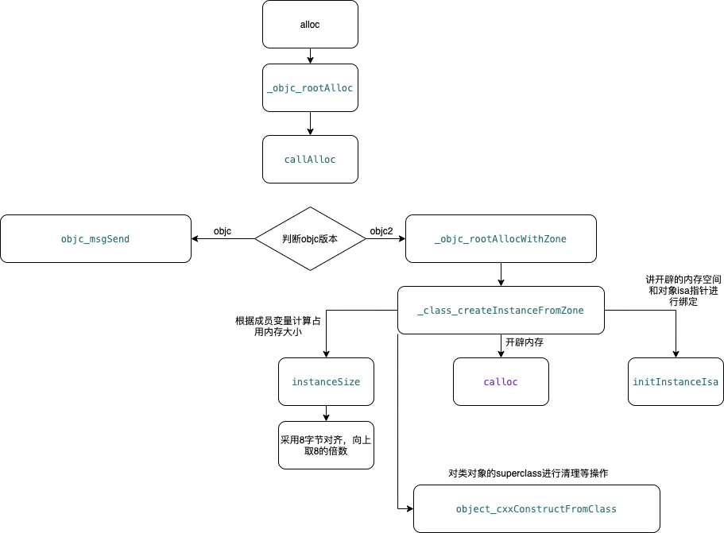
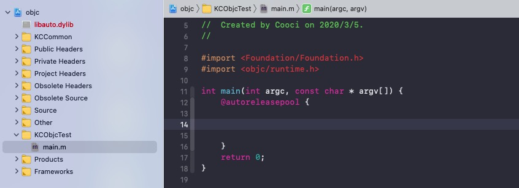
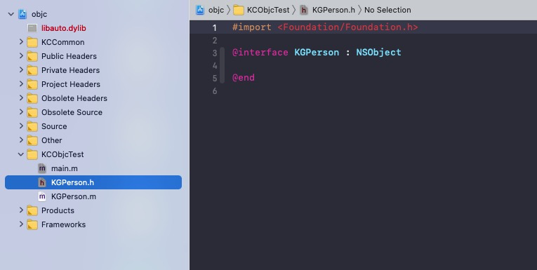
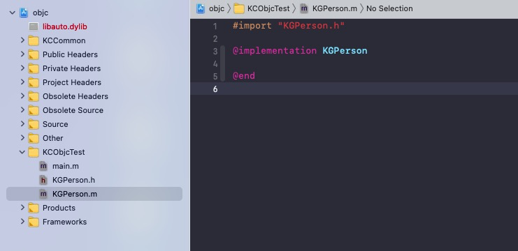
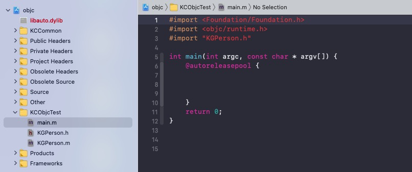

# alloc 底层原理


> 在 iOS 开发中，创建对象的时候，经常会用到一个函数`alloc`，所以今天就探索下`alloc`的底层原理，俗话说工欲善其事必先利其器，下面我们介绍下，探索底层的东西，需要的一些基本准备东西。

### 准备工作

1、[objc](https://opensource.apple.com/source/)是探索底层原理的一个重要工具，我们可以通过苹果开源的东西，去了解他的设计理念以及程序运行的流程，目前最新的是`objc4-824`，我的设备上运行起来的是`objc4-779.1`。主要是自己电脑是13年中期的古董机，系统版本卡在10.14没有往上升级，因为升级上去比较卡，所以最高也就只能配置`objc4-779.1`了。

2、肯定是对 iOS 开发有所了解了，起码得有 iOS 实际开发经验最少也得半年或者一年以上吧。

3、手头有一台 Mac 电脑，Mac 电脑上安装 Xcode。

4、具体[objc源码配置问题](https://github.com/LGCooci/objc4_debug)可以找到Cooci大神的Github地址中查看缺少文件以及报错问题。

......嗯，暂时就这些吧~~~

### alloc 底层原理探索

>作者：巴拉巴拉
>读者：无图说个锤子
>作者：收到，如下图：



1、首先打开已经配置好的`objc`项目。项目打开后如下图所示：



2、接下来就开始不如今天探索的重点，我们在创建一个对象的时候，总是会写`[KGPerson alloc]`，这个 alloc 是干什么的，我想很多人都能回答(创建对象，并给对象开辟内存空间)，但是他的内部是怎么实现的，创建的对象开辟了多少内存？怎么计算的？很多人到这里就开启了一万个为什么模式。那好，下面我们开始一起探索这些问题。

3、我们在编译好的 objc 工程中，在`KCObjcTest`文件夹下创建基于 NSObject 的类`KGPerson`，然后在`main.m`文件中引入头文件`# import "KGPerson.h"`。各个文件内容如下：

> KGPerson.h 文件



> KGPerson.m 文件



> main.m 文件



4、然后我们在`main.m`文件中创建一个`KGPerson`对象，代码如下：

```
KGPerson *person = [KGPerson alloc];
```

5、然后我们点击`alloc`进入`objc`源码中我们会看到`alloc`在底层又是调用了另外一个函数，如下代码，程序在编译运行期间，想如下这种一个方法实现中只有返回值，而且返回值是另外一个方法时，系统会直接走返回值的方法，如果我们打开反汇编模式，查看汇编代码的时候，```alloc```第一个调用的方法就是```callAlloc```

```
+ (id)alloc {
    return _objc_rootAlloc(self);
}
```

6、这个方法的意义就在于向下一层函数传入两个值```checkNil```以及```allocWithZone```，具体的作用后面到了用到的地方再解释，点击`_objc_rootAlloc`后我们又跳入到`_objc_rootAlloc`方法实现里面，发现还不是我们想要的结果，因为它里面直接 return 了另外一个函数，如下代码：

```
id
_objc_rootAlloc(Class cls)
{
    return callAlloc(cls, false/*checkNil*/, true/*allocWithZone*/);
}
```

7、在这个方法出现了两个比较特别的宏```slowpath```(告诉编译器，传入的条件结果为假的可能性很大)和```fastpath```(告诉编译器，传入的条件结果为真的可能性很大)，其他的在代码汇总有注释，点击`callAlloc`函数，发现进入函数实现后，变了，出现`if`条件判断了，这时候我们就犯难了，不知道程序运行会走哪个？不要着急我们慢慢梳理，```__OBJC2__```这个关键词就是判断objc的版本的，现在用的都是新版的objc，所以就会走上面的if条件，继续看代码:

```
static ALWAYS_INLINE id
callAlloc(Class cls, bool checkNil, bool allocWithZone=false)
{
#if __OBJC2__
    /*告诉编译器，传入的条件结果为假的可能性很大，所以不会走这个if判断，所以也不会返回nil*/
    if (slowpath(checkNil && !cls)) return nil;
    /*告诉编译器，传入的条件结果为真的可能性很大，这个判断就是去检测，传入的这个类是否实现了allocWithZone方法*/
    if (fastpath(!cls->ISA()->hasCustomAWZ())) {
        return _objc_rootAllocWithZone(cls, nil);
    }
#endif

    // No shortcuts available.
    if (allocWithZone) {
        return ((id(*)(id, SEL, struct _NSZone *))objc_msgSend)(cls, @selector(allocWithZone:), nil);
    }
    return ((id(*)(id, SEL))objc_msgSend)(cls, @selector(alloc));
}
```

8、进入函数后，发现里面还是直接返回了一个函数，代码如下，然后我们继续查看`_class_createInstanceFromZone`函数的实现。

```
id
_objc_rootAllocWithZone(Class cls, malloc_zone_t *zone __unused)
{
    // allocWithZone under __OBJC2__ ignores the zone parameter
    //zone 参数不再使用 类创建实例内存空间
    return _class_createInstanceFromZone(cls, 0, nil,
                                         OBJECT_CONSTRUCT_CALL_BADALLOC);
}
```


9、```_class_createInstanceFromZone```这个方法及时alloc的核心代码了，代码如下：

```
static ALWAYS_INLINE id
_class_createInstanceFromZone(Class cls, size_t extraBytes, void *zone,
                              int construct_flags = OBJECT_CONSTRUCT_NONE,
                              bool cxxConstruct = true,
                              size_t *outAllocatedSize = nil)
{
    /**锁定:为了防止并发实现，保持运行时锁定。*/
    ASSERT(cls->isRealized());

    // Read class's info bits all at once for performance
    //一次读取所有类的信息位以提高性能
    bool hasCxxCtor = cxxConstruct && cls->hasCxxCtor();
    bool hasCxxDtor = cls->hasCxxDtor();
    bool fast = cls->canAllocNonpointer();
    size_t size;

    // 计算类需要开辟的内存空间大小，传入的extraBytes=0
    size = cls->instanceSize(extraBytes);
    if (outAllocatedSize) *outAllocatedSize = size;

    id obj;
    if (zone) {
        obj = (id)malloc_zone_calloc((malloc_zone_t *)zone, 1, size);
    } else {
        // 申请内存空间
        obj = (id)calloc(1, size);
    }
    if (slowpath(!obj)) {
        if (construct_flags & OBJECT_CONSTRUCT_CALL_BADALLOC) {
            return _objc_callBadAllocHandler(cls);
        }
        return nil;
    }

    if (!zone && fast) {
        // 将类cls和obj指针进行关联
        obj->initInstanceIsa(cls, hasCxxDtor);
    } else {
        // Use raw pointer isa on the assumption that they might be
        // doing something weird with the zone or RR.
        obj->initIsa(cls);
    }

    if (fastpath(!hasCxxCtor)) {
        return obj;
    }

    construct_flags |= OBJECT_CONSTRUCT_FREE_ONFAILURE;
    return object_cxxConstructFromClass(obj, cls, construct_flags);
}
```

> 我们先看下`size = cls->instanceSize(extraBytes);`这句代码，这是去计算当前对象需要开辟多少内存空间，我们一起看下`instanceSize`这个函数的实现。

```
inline size_t instanceSize(size_t extraBytes) const {
        if (fastpath(cache.hasFastInstanceSize(extraBytes))) {
            return cache.fastInstanceSize(extraBytes);
        }
        
        //计算需类需要的内存空间大小
        size_t size = alignedInstanceSize() + extraBytes;
        // CF requires all objects be at least 16 bytes.
        // 如果占用的内存空间小于16，直接返回16，这个就是为什么新建的类和类中有一个属性但是需要的空间一样的原因
        if (size < 16) size = 16;
        return size;
    }
```

>我们继续看下```size_t size = alignedInstanceSize() + extraBytes;```这句代码，```extraBytes```从函数调用开始就传入的是0，所以我们看下函数```alignedInstanceSize```和```word_align```的实现。

```
// Class's ivar size rounded up to a pointer-size boundary.
    uint32_t alignedInstanceSize() const {
        // 去计算需要的空间大小，而且同时字节对齐
        return word_align(unalignedInstanceSize());
    }

    static inline size_t word_align(size_t x) {
    // 根据计算出来的需要的内存空间大小，进行8字节对齐运算
    // ~WORD_MASK是WORD_MASK的值取反
    // (x + WORD_MASK) & ~WORD_MASK的意思是用WORD_MASK取反的值和(x + WORD_MASK)值进行与运算，最后得到的结果就是需要的内存空间大小
    return (x + WORD_MASK) & ~WORD_MASK;
    // 这个也可以换个写法
    return (x + WORD_MASK) >> 3 << 3;
}
```

>然后回到```_class_createInstanceFromZone```函数里面，调用```calloc```函数进行内存空间开辟。

10、开辟内存空间后，调用```object_cxxConstructFromClass```函数，进行对象创建赋值等。我们进去该函数看下：

```
id 
object_cxxConstructFromClass(id obj, Class cls, int flags)
{
    ASSERT(cls->hasCxxCtor());  // required for performance, not correctness

    id (*ctor)(id);
    Class supercls;

    supercls = cls->superclass;

    // Call superclasses' ctors first, if any.
    if (supercls  &&  supercls->hasCxxCtor()) {
        bool ok = object_cxxConstructFromClass(obj, supercls, flags);
        if (slowpath(!ok)) return nil;  // some superclass's ctor failed - give up
    }

    // Find this class's ctor, if any.
    ctor = (id(*)(id))lookupMethodInClassAndLoadCache(cls, SEL_cxx_construct);
    if (ctor == (id(*)(id))_objc_msgForward_impcache) return obj;  // no ctor - ok
    
    // Call this class's ctor.
    if (PrintCxxCtors) {
        _objc_inform("CXX: calling C++ constructors for class %s", 
                     cls->nameForLogging());
    }
    if (fastpath((*ctor)(obj))) return obj;  // ctor called and succeeded - ok

    supercls = cls->superclass; // this reload avoids a spill on the stack

    // This class's ctor was called and failed.
    // Call superclasses's dtors to clean up.
    if (supercls) object_cxxDestructFromClass(obj, supercls);
    if (flags & OBJECT_CONSTRUCT_FREE_ONFAILURE) free(obj);
    if (flags & OBJECT_CONSTRUCT_CALL_BADALLOC) {
        return _objc_callBadAllocHandler(cls);
    }
    return nil;
}
```

>进入方法后进行```if (supercls  &&  supercls->hasCxxCtor())```判断，然后从基类开始递归调用C++构造函数。如果函数构造成功，返回对象，如果构建失败，返回nil，并跑出异常，之前构造的所有数据全部破坏。然后将得到的对象逐层返回回去，最后我们得到```KGPerson```的对象。

12、我们验证下，前面分配内存的结论是否正确，先创建一个空的对象，获取实际分配内存和需要的内存：

```
16----8
```

>然后我们在```KGPerson```类中新增两个属性，如下代码：

```
@interface KGPerson : NSObject

@property (nonatomic, copy) NSString *name;
@property (nonatomic, assign) NSInteger age;

@end
```

>然后我们运行程序，打印接入如下：

```
32----24
```

13、到此对于alloc的探索就结束了

### 结语：

>个人也是逐渐的摸索前进中，如有失误，请及时联系修正，防止误导他人，大神勿嘭！！！
