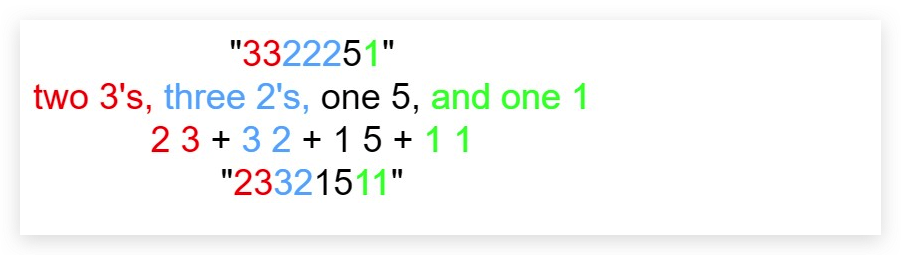
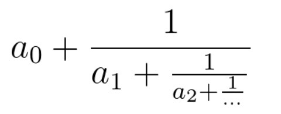

# iOS面试算法题收集（一）

### 提示：题目均来自于<a href="https://leetcode-cn.com/problems/master-mind-lcci">力扣（LeetCode）</a>

一、给定一个整数数组和一个目标值，找出数组中和为目标值的两个数，你可以假设每个输入只对应一种答案，且同样的元素不能重复利用。

>示例：

```
给定数组 NSArray *arr = @[2,7,11,15,20]; NSInteger target = 9;

因为 arr[0] + arr[1] = 9;

所以返回[0,1]
```

>解决思路：

```
1、首先肯定需要循环，第一层for循环，arr的下标为0，开始走，获取数组每个元素arr[i]
2、第二层for循环，从上层循环的i+1开始走，获取后面数据arr[j]，保证每次两层循环都不会拿到重复数据
3、arr[i]+arr[j]如果等于target，那就输出下标以及元素。
```

>OC示例代码

```
NSInteger target = 11;
NSArray *arr = @[@(2),@(11),@(7),@(9),@(0),@(3),@(6),@(1),@(8),@(5),@(4),@(111)];

for (int i = 0; i < arr.count; i++) {
    for (int j = i+1; j < arr.count; j++) {
        if ([arr[i] integerValue] + [arr[j] integerValue] == target) {
            NSLog(@"%@(%d) + %@(%d) = %ld\n",arr[i],i,arr[j],j,(long)target);
        }
    }
}
```

>输出结果：
```
2(0) + 9(3) = 11
11(1) + 0(4) = 11
7(2) + 4(10) = 11
3(5) + 8(8) = 11
6(6) + 5(9) = 11
```

二、给定两个非空链表，表示两个非负整数，位数按照逆序方式存储，他们的每个节点只存储单个数字，将两数相加，返回一个新的链表，你可以假设除了数字0之外,这2个数字都不会以零开头.

>示例：

```
NSArray *firstArr = @[@(2),@(4),@(3)];
NSArray *lastArr = @[@(5),@(6),@(4)];
输出[7,0,8]
```

>解决思路：

```
1、首先用两个数据表示链表，存储给定的数据
2、然后用两个NSInteger表示给定的数据
3、使用for循环倒序遍历计算给定的数据，并赋值给NSInteger
4、计算两个数的和，并使用一个NSInteger存储
5、创建一个数组，使用while循环，取余将余数添加到数组
6、输出数组
```

>OC示例代码

```
NSArray *starArr = @[@(2),@(4),@(3)];
NSArray *endArr = @[@(5),@(6),@(4)];
NSMutableArray *resArr = [NSMutableArray array];

NSInteger starInt = 0;
NSInteger endInt = 0;
NSInteger result = 0;
for (NSInteger i = starArr.count-1; i >= 0; i--) {
    starInt = starInt*10+[starArr[i] integerValue];
}
for (NSInteger i = endArr.count-1; i >= 0; i--) {
    endInt = endInt*10+[endArr[i] integerValue];
}

result = starInt+endInt;

while (result>9) {
    [resArr addObject:@(result%10)];
    result = (result-(result%10))/10;
}

[resArr addObject:@(result)];

if ([resArr[0] integerValue] == 0) {
    [resArr removeObjectAtIndex:0];
}
```

>输出结果

```
342 + 465 = 807
(7,0,8)
```
三、给你一个 32 位的有符号整数 x ，返回将 x 中的数字部分反转后的结果。如果反转后整数超过 32 位的有符号整数的范围 [−231,  231 − 1] ，就返回 0。假设环境不允许存储 64 位整数（有符号或无符号）。

>解决思路

```
1、先进行数据转换，因为不确定是正整数还是负整数
2、然后从转换后的整数从后取值，赋给新值，能保证是倒叙
3、每次赋值时原先基础上乘十然后加上新值，保证新值永远在个位数增加
4、倒叙结束后，判断初始值是负整数还是正整数，加上符号
5、判断是否超出限制区间，如果超出直接返回0
```
>Swift示例代码:

```
class Solution {
    func reverse(_ x: Int) -> Int {
        
        var res:Int = 0;
        var tmp = abs(x);
        
        while tmp > 0 {
            res = res*10 + tmp%10;
            tmp = tmp/10
        }
        
        if x < 0 {
            res = 0 - res;
        }
        
        if ((-1<<31 <= res) && (res <= (1<<31-1)))  {
            return res;
        }else{
            return 0;
        }
    }
}
```
>输出结果: 

```
-321
```
四、给你一个整数 x ，如果 x 是一个回文整数，返回 true ；否则，返回 false 。回文数是指正序（从左向右）和倒序（从右向左）读都是一样的整数。例如，121 是回文，而 123 不是。

>解决思路：

```
1、先判断是否是负数，如果是负数直接返回false
2、先进行数据转换，因为不确定是正整数还是负整数
3、然后从转换后的整数从后取值，赋给新值，能保证是倒叙
4、每次赋值时原先基础上乘十然后加上新值，保证新值永远在个位数增加
5、然后判断是否在运行区间内，如果不在直接返回false
6、判断是否相等
```

>Swift代码示例:

```
class Solution {
    func isPalindrome(_ x: Int) -> Bool {
        if x < 0 {
            return false;
        }

        var res:Int = 0;
        var tmp = abs(x);

        while tmp > 0 {
            res = res*10 + tmp%10;
            tmp = tmp/10
        }
        
        if ((-1<<31 <= res) && (res <= (1<<31-1)))  {
            return res == x;
        }else{
            return false;
        }
    }
}
```

五、罗马数字包含以下七种字符: I， V， X， L，C，D 和 M。

```
字符          数值
I             1
V             5
X             10
L             50
C             100
D             500
M             1000
```
例如， 罗马数字 2 写做 II ，即为两个并列的 1。12 写做 XII ，即为 X + II 。 27 写做  XXVII, 即为 XX + V + II 。通常情况下，罗马数字中小的数字在大的数字的右边。但也存在特例，例如 4 不写做 IIII，而是 IV。数字 1 在数字 5 的左边，所表示的数等于大数 5 减小数 1 得到的数值 4 。同样地，数字 9 表示为 IX。这个特殊的规则只适用于以下六种情况：

>I 可以放在 V (5) 和 X (10) 的左边，来表示 4 和 9。
>
>X 可以放在 L (50) 和 C (100) 的左边，来表示 40 和 90。 
>
>C 可以放在 D (500) 和 M (1000) 的左边，来表示 400 和 900。

给定一个罗马数字，将其转换成整数。输入确保在 1 到 3999 的范围内。

>解决思路：

```
1、首先将给定字符串切割成单个字符，加入到数组中
2、遍历过程中取出数组最后一个字符，判断是否比当前的小，如果小那就移除之前的，添加差值
3、遍历数组中的值进行累加
```

>Swift代码示例：

```
class Solution {
    func romanToInt(_ s: String) -> Int {
        
        let arr:NSMutableArray = NSMutableArray();
        
        for tmp:Character in s {
            let str = String.init(tmp)
            var currValue = 0;
            if str.elementsEqual("I") {
                currValue = 1;
            }else if str.elementsEqual("V") {
                currValue = 5;
            }else if str.elementsEqual("X") {
                currValue = 10;
            }else if str.elementsEqual("L") {
                currValue = 50;
            }else if str.elementsEqual("C") {
                currValue = 100;
            }else if str.elementsEqual("D") {
                currValue = 500;
            }else if str.elementsEqual("M") {
                currValue = 1000;
            }
            if arr.count > 0 {
                let leftvalue:Int = arr[arr.count-1] as! Int;
                if leftvalue < currValue {
                    arr.removeLastObject();
                    arr.add((currValue-leftvalue))
                }else{
                    arr.add(currValue)
                }
            }else{
                arr.add(currValue)
            }
        }
        
        var res = 0;
        
        for index in 0..<arr.count {
            let leftvalue:Int = arr[index] as! Int
            res += leftvalue
        }
        
        return res
    }
}
```
六、编写一个函数来查找字符串数组中的最长公共前缀。如果不存在公共前缀，返回空字符串 ""。

>解决思路:

```
1、先计算最小字符串长度
2、按照最小字符串进行遍历，从每个字符串0个开始去字符比较
3、如果字符都有，拼接到公共开头字符串中
4、如果出现不一致的开头直接返回，先前结果
```
>Swift示例代码：

```
class Solution {
    func longestCommonPrefix(_ strs: [String]) -> String {
        var minStr:Int = 200
        
        for str in strs {
            if str.lengthOfBytes(using: String.Encoding.utf8) < minStr {
                minStr = str.lengthOfBytes(using: String.Encoding.utf8)
            }
        }
        
        var res = ""
        
        for index in 0..<minStr {
            var tmpRes = ""
            var count = 0
            
            for str in strs {
                if tmpRes == "" {
                    tmpRes = String.init(str[String.Index(encodedOffset: index)])
                }
                
                if String.init(str[String.Index(encodedOffset: index)]) != tmpRes {
                    count += 1
                }
            }
            
            if (tmpRes != "" && count == 0) {
                res += tmpRes
            }else{
                return res
            }
        }
        return res
    }
}
```
七、给定一个只包括 '('，')'，'{'，'}'，'['，']' 的字符串 s ，判断字符串是否有效。有效字符串需满足：
>1、左括号必须用相同类型的右括号闭合。
>
>2、左括号必须以正确的顺序闭合。

>解决思路

```
1、传入的字符串是否有效在于括号是否对应，所以创建一个数组，将字符串从头开始遍历，遇到括号就添加，每次添加前先判断数组是否为空，如果为空直接添加，如果不为空取最后一个进行判断是否是和当前括号对应
2、如果数组最后一个括号与当前的对应，那么就删除数组最后一个值，当前值不做添加操作
3、就是遇到左括号就往数组中添加，遇到右括号，就取数组最后一个值，看是否对应，如果对应就解，如果不对应，继续添加
4、最后判断数组是否为空来确定是否符合，为空表示有效
```
>Swift示例代码

```
class Solution {
    func isValid(_ s: String) -> Bool {
        let arr:NSMutableArray = NSMutableArray()
        
        for char in s {
            if arr.count > 0 {
                if String(char) == foundValidValue(arr.lastObject as! String) {
                    arr.removeLastObject()
                }else{
                    arr.add(String(char))
                }
            }else{
                arr.add(String(char))
            }
        }
        return arr.count==0
    }
    
    func foundValidValue(_ s:String) -> String {
        if s == "(" {
            return ")"
        }else if s == "[" {
            return "]"
        }else if s == "{"  {
            return "}"
        }else{
            return ""
        }
    }
}
```
八、将两个升序链表合并为一个新的 升序 链表并返回。新链表是通过拼接给定的两个链表的所有节点组成的。 


>解决思路

```
1、先判断是否为空，如果有空直接根据条件，返回相应值
2、做递归进行判断，左侧链表的值大还是右侧链表值大，将小的值赋值个新链表当前节点，next值递归
```
>Swift示例代码

```
public class ListNode {
    public var val:Int
    public var next:ListNode?
    public init() {
        self.val = 0;
        self.next = nil;
    }
    public init(_ val:Int){
        self.val = val;
        self.next = nil;
    }
    public init(_ val:Int,_ next:ListNode?){
        self.val = val;
        self.next = next;
    }
}

class Solution {
    func mergeTwoLists(_ l1: ListNode?, _ l2: ListNode?) -> ListNode? {
        let list = ListNode.init()
        if l1 == nil && l2 != nil {
            return l2
        }
        if l2 == nil && l1 != nil{
            return l1
        }
        if l1 == nil && l2 == nil {
            return nil
        }
        if l1!.val > l2!.val {
            list.val = l2!.val
            if l2?.next == nil {
                list.next = l1
            }else{
                list.next = mergeTwoLists(l1, l2?.next)
            }
        }else{
            list.val = l1!.val
            if l1?.next == nil {
                list.next = l2
            }else{
                list.next = mergeTwoLists(l1?.next, l2)
            }
        }
        return list
    }
    
    func compareTwoLists(_ arr:NSMutableArray) -> ListNode? {
        let list = ListNode.init()
        if arr.count > 0 {
            list.val = arr.firstObject as! Int;
            arr.remove(arr.firstObject as Any)
            if arr.count > 0 {
                list.next = compareTwoLists(arr)
            }
            return list
        }else{
            return nil
        }
    }
}
```
九、给你一个有序数组 nums ，请你 原地 删除重复出现的元素，使每个元素 只出现一次 ，返回删除后数组的新长度。不要使用额外的数组空间，你必须在 原地 修改输入数组 并在使用 O(1) 额外空间的条件下完成。

####说明:

为什么返回数值是整数，但输出的答案是数组呢?

请注意，输入数组是以「引用」方式传递的，这意味着在函数里修改输入数组对于调用者是可见的。

你可以想象内部操作如下:

```
// nums 是以“引用”方式传递的。也就是说，不对实参做任何拷贝
int len = removeDuplicates(nums);

// 在函数里修改输入数组对于调用者是可见的。
// 根据你的函数返回的长度, 它会打印出数组中 该长度范围内 的所有元素。
for (int i = 0; i < len; i++) {
    print(nums[i]);
}
```
>解决思路

```
1、首先判断数组是否为空，为空直接返回0
2、数组不为空的情况下，至少有一个不重复的元素
3、因为数组是有序的数组，所以只需要判断相邻元素是否相同，如果发现不相同的元素，往前移动，使用一个值来记录移动的元素个数
4、最后得到的移动元素个数值就是新数组长度
```
>Swift示例代码

```
class Solution {
    func removeDuplicates(_ nums: inout [Int]) -> Int {
        if nums.count == 0 {
            return 0
        }
        
        var fast = 1
        var slow = 1
        
        while fast < nums.count {
            if nums[fast] != nums[fast-1] {
                nums[slow] = nums[fast]
                slow += 1
            }
            fast += 1
        }
        return slow
    }
}
```

十、给你一个数组 nums 和一个值 val，你需要 原地 移除所有数值等于 val 的元素，并返回移除后数组的新长度。不要使用额外的数组空间，你必须仅使用 O(1) 额外空间并 原地 修改输入数组。元素的顺序可以改变。你不需要考虑数组中超出新长度后面的元素。
####说明:
为什么返回数值是整数，但输出的答案是数组呢?

请注意，输入数组是以「引用」方式传递的，这意味着在函数里修改输入数组对于调用者是可见的。

你可以想象内部操作如下:

```
// nums 是以“引用”方式传递的。也就是说，不对实参作任何拷贝
int len = removeElement(nums, val);

// 在函数里修改输入数组对于调用者是可见的。
// 根据你的函数返回的长度, 它会打印出数组中 该长度范围内 的所有元素。
for (int i = 0; i < len; i++) {
    print(nums[i]);
}
```
>解决思路

```
1、首先判断数组是否为空，为空直接返回0
2、因为给定了需要移除的元素，所以只需要遍历数组，找到相同元素进行移除，但是如果用for循环，遍历过程中数组长度发生变化容易跳过相邻元素的比对，所以使用while循环，使用外部值，当找到需要删除元素时，对查找的下标指针进行减一操作，防止跳过元素检查
3、最后遍历结束后得到的数组就是去除给定元素后的新数组
```

>Swift示例代码

```
class Solution {
    func removeElement(_ nums: inout [Int], _ val: Int) -> Int {
        if nums.count == 0 {
            return 0
        }
        
        var fast = 0
        while fast < nums.count {
            if nums[fast] == val {
                nums.remove(at: fast)
                fast -= 1
            }
            fast += 1
        }
        return nums.count
    }
}
```
十一、实现 strStr() 函数。给你两个字符串 haystack 和 needle ，请你在 haystack 字符串中找出 needle 字符串出现的第一个位置（下标从 0 开始）。如果不存在，则返回  -1 。
####说明：
当 needle 是空字符串时，我们应当返回什么值呢？这是一个在面试中很好的问题。

对于本题而言，当 needle 是空字符串时我们应当返回 0 。这与 C 语言的 strstr() 以及 Java 的 indexOf() 定义相符。

>解决思路

```
1、首先读懂题意，查找字符串中是否包含某个字符串
2、当存在时返回第一次出现的字符串所在部分开头下标
3、如果指定字符串为空，返回0
4、如果需要目标字符串为空，返回-1
5、两个字符串长度不能超过50000
6、根据以上结果，先进行条件判断，不满足条件的直接根据相应要求返回对应状态
7、在字符串中查找，最快方法从字符串开头位置移动指针，根据指针偏移量以及查找字符串的长度，截取字符串比较是否相等，如果相等直接返回指针对应的下标
```
>Swift示例代码

```
class Solution {
    func strStr(_ haystack: String, _ needle: String) -> Int {
        
        if needle.lengthOfBytes(using: String.Encoding.utf8) == 0 {
            return 0
        }
        
        if haystack.lengthOfBytes(using: String.Encoding.utf8) == 0 {
            return -1
        }
        
        if haystack.lengthOfBytes(using: String.Encoding.utf8) > 5*10000 {
            return -1
        }
        
        if needle.lengthOfBytes(using: String.Encoding.utf8) > 5*10000 {
            return -1
        }
        
        if needle.lengthOfBytes(using: String.Encoding.utf8) == haystack.lengthOfBytes(using: String.Encoding.utf8) {
            if needle == haystack {
                return 0
            }else{
                return -1
            }
        }
        
        var fast = 0
        
        while fast < haystack.lengthOfBytes(using: String.Encoding.utf8) {
            if (fast + needle.lengthOfBytes(using: String.Encoding.utf8)) <= haystack.lengthOfBytes(using: String.Encoding.utf8) {
                let starIndex = haystack.index(haystack.startIndex,offsetBy: fast)
                let endIndex = haystack.index(haystack.startIndex,offsetBy: fast+needle.lengthOfBytes(using: String.Encoding.utf8)-1)
                let str = haystack[starIndex...endIndex]
                if str == needle {
                    return fast
                }
            }
            fast += 1
        }
        
        return -1
    }
}
```
十二、给定一个排序数组和一个目标值，在数组中找到目标值，并返回其索引。如果目标值不存在于数组中，返回它将会被按顺序插入的位置。你可以假设数组中无重复元素。

>解决思路

```
1、首先确定数组是通过排序的，所以只需要遍历一次就可以确定有没有，如果没有应该放在哪个位置
2、当我们遍历的时候，先判断是否相等，来确定是否包含，然后判断是否遍历的当前值是否大于给定值，如果大于，就说明数组中不包含给定值，我们就将给定值插入到当前值的前面，下标就是当前值的原下标
3、如果遍历完数组后，还是没有找到，那就说明给定值比数组中的任何一个值都大，所以直接添加到数组结尾，下标为原数组长度值
```
>Swift示例代码

```
class Solution {
    func searchInsert(_ nums: [Int], _ target: Int) -> Int {
        if nums.count == 0 {
            return 0
        }
        var fast = 0
        while fast < nums.count {
            if nums[fast] == target {
                return fast
            }
            if nums[fast] > target {
                return fast
            }
            fast += 1
        }
        return nums.count
    }
}
```
十三、给定一个正整数 n ，输出外观数列的第 n 项。「外观数列」是一个整数序列，从数字 1 开始，序列中的每一项都是对前一项的描述。你可以将其视作是由递归公式定义的数字字符串序列：

```
countAndSay(1) = "1"
countAndSay(n) 是对 countAndSay(n-1) 的描述，然后转换成另一个数字字符串。
```
前五项如下：

```
1.     1
2.     11
3.     21
4.     1211
5.     111221
第一项是数字 1 
描述前一项，这个数是 1 即 “ 一 个 1 ”，记作 "11"
描述前一项，这个数是 11 即 “ 二 个 1 ” ，记作 "21"
描述前一项，这个数是 21 即 “ 一 个 2 + 一 个 1 ” ，记作 "1211"
描述前一项，这个数是 1211 即 “ 一 个 1 + 一 个 2 + 二 个 1 ” ，记作 "111221"
```
要 描述 一个数字字符串，首先要将字符串分割为 最小 数量的组，每个组都由连续的最多 相同字符 组成。然后对于每个组，先描述字符的数量，然后描述字符，形成一个描述组。要将描述转换为数字字符串，先将每组中的字符数量用数字替换，再将所有描述组连接起来。

例如，数字字符串 "3322251" 的描述如下图：



>解决思路

```
1、首先理解题意，根据传入的整型，做外观队列，即（整型控制循环次数，每次循环对从1开始的字符串进行描述）
2、理解题意后，进行外层循环，这个循环用给定的整型控制
3、内部循环中使用一个字符串记录每一次循环结束后记录本次的描述，作为下一次的初始值
4、依次进行循环，直到达到边界
```
>Swift示例代码

```
class Solution {
    func countAndSay(_ n: Int) -> String {
        
        if n == 1 {
            return "1"
        }
        
        if n == 0 {
            return ""
        }
        
        var val = 1;
        var str = "1";
        
        while val < n {
            let tmp = str
            var tmpRes = ""
            var count = 0
            var ch:Character = "A"
            for char in tmp {
                if ch == "A" {
                    ch = char
                }
                if char == ch {
                    count += 1
                }else{
                    tmpRes += String(count)+String(ch)
                    ch = char
                    count = 1
                }
            }
            tmpRes += String(count)+String(ch)
            str = tmpRes
            val += 1
        }
        return String(str)
    }
}
```
十四、给定一个整数数组 nums ，找到一个具有最大和的连续子数组（子数组最少包含一个元素），返回其最大和。

>解决思路

```
1、数组不是有序的，而且有正整数和负整数，并不限制数组长度
2、首先过滤元素是否满足条件
3、通过移动数组两边的指针，然后对区间内的元素进行累加，取最大值输出
```
>Swift示例代码

```
class Solution {
    func maxSubArray(_ nums: [Int]) -> Int {
        
        if nums.count == 1 {
            return nums[0]
        }
        
        if nums.count == 0 {
            return 0
        }
        
        if nums.count > 30000 {
            return 0
        }
        
        var sum = -100000
        
        for i in 0..<nums.count {
            if nums[i] > 100000 || nums[i] < -100000 {
                return 0
            }
            var j = nums.count-1
            var tmpSum = 0
            while j >= i {
                for index in i...j {
                    tmpSum += nums[index]
                    if tmpSum > sum {
                        sum = tmpSum
                    }
                    j -= 1
                }
            }
        }
        return sum
    }
}
```
十五、给你一个字符串 s，由若干单词组成，单词之间用空格隔开。返回字符串中最后一个单词的长度。如果不存在最后一个单词，请返回 0 。单词 是指仅由字母组成、不包含任何空格字符的最大子字符串。

>解决思路

```
1、根据题意，字符串只包含空格以及英文字母，所以不需要去过滤
2、判断字符串是否为空，如果为空直接返回0
3、判断字符串中是否全部为空格，如果是，返回0
4、将字符串以空格进行切割，合法字符串切割成数组后，数组至少包含一个元素，直接获取最后一个元素，返回其长度就OK了
```
>Swift示例代码

```
class Solution {
    func lengthOfLastWord(_ s: String) -> Int {
        
        let arr = s.split(separator: " ")
        
        if arr.count == 1 {
            return arr[0].lengthOfBytes(using: String.Encoding.utf8)
        }
        if arr.count == 0 {
            return 0
        }
        
        if s.lengthOfBytes(using: String.Encoding.utf8) > 10000 {
            return 0
        }
        
        return arr[arr.count-1].lengthOfBytes(using: String.Encoding.utf8)
    }
}
```
十六、给定一个由 整数 组成的 非空 数组所表示的非负整数，在该数的基础上加一。最高位数字存放在数组的首位， 数组中每个元素只存储单个数字。你可以假设除了整数 0 之外，这个整数不会以零开头。

>解决思路

```
1、数组是非空，元素是正整数以及0
2、数组是表示一个完整的整数
3、得到数组表示的整数后进行加1操作
4、然后将加1后的数组，转换成数组输出
```
>Swift示例代码

```
class Solution {
    func plusOne(_ digits: [Int]) -> [Int] {
        
        if digits.count > 100 {
            return []
        }
        
        var sum = ""
        
        for index in 0..<digits.count {
            if digits[index] > 10 {
                return []
            }
            sum += String(digits[index])
        }
        
        var last = sum.removeLast()
        var addStr = ""
        
        while Int(String(last))! == 9 {
            addStr += "0"
            if sum.lengthOfBytes(using: String.Encoding.utf8) > 0 {
                last = sum.removeLast()
            }else{
                last = "0"
            }
        }
        
        sum += String(Int(String(last))!+1) + addStr
        
        let arr:NSMutableArray = NSMutableArray()
        
        last = sum.removeFirst()
        
        while sum.lengthOfBytes(using: String.Encoding.utf8) > 0 {
            arr.add(Int(String(last))!)
            last = sum.removeFirst()
        }
        arr.add(Int(String(last))!)
        return arr as! [Int]
    }
}
```
十七、给你两个二进制字符串，返回它们的和（用二进制表示）。输入为 非空 字符串且只包含数字 1 和 0。

>解决思路

```
1、因为给定的是二进制字符串，所以开头不会出现0，并且是非空字符串，所以只需要确定最长字符串
2、按照最长字符串进行遍历，判断是否需要向前进1
```
>Swift示例代码

```
class Solution {
    func addBinary(_ a: String, _ b: String) -> String {
        
        if a.lengthOfBytes(using: String.Encoding.utf8) > 10000 || b.lengthOfBytes(using: String.Encoding.utf8) > 10000 {
            return ""
        }
        
        if a.lengthOfBytes(using: String.Encoding.utf8) == 0 {
            return b
        }
        
        if b.lengthOfBytes(using: String.Encoding.utf8) == 0 {
            return a
        }
        
        var leftVal = a
        var rightVal = b
        
        var isAdd = false
        var res = ""
        
        var count = 0
        
        if rightVal.lengthOfBytes(using: String.Encoding.utf8) > leftVal.lengthOfBytes(using: String.Encoding.utf8) {
            while (count < b.lengthOfBytes(using: String.Encoding.utf8)) {
                if leftVal.lengthOfBytes(using: String.Encoding.utf8) > 0 {
                    let tmp = Int(String(rightVal.removeLast()))!+Int(String(leftVal.removeLast()))!
                    var needAdd = tmp > 1 ? 0 : tmp
                    if tmp > 1 {
                        if isAdd {
                            needAdd += 1
                        }
                        isAdd = true
                    }else{
                        if isAdd {
                            needAdd += 1
                        }
                        isAdd = needAdd > 1
                    }
                    res = String(needAdd > 1 ? 0 : needAdd) + res
                }else{
                    let tmp = Int(String(rightVal.removeLast()))!
                    var needAdd = tmp > 1 ? 0 : tmp
                    if tmp > 1 {
                        if isAdd {
                            needAdd += 1
                        }
                        isAdd = true
                    }else{
                        if isAdd {
                            needAdd += 1
                        }
                        isAdd = needAdd > 1
                    }
                    res = String(needAdd > 1 ? 0 : needAdd) + res
                }
                count += 1
            }
        }else{
            while (count < a.lengthOfBytes(using: String.Encoding.utf8)) {
                if rightVal.lengthOfBytes(using: String.Encoding.utf8) > 0 {
                    let tmp = Int(String(rightVal.removeLast()))!+Int(String(leftVal.removeLast()))!
                    var needAdd = tmp > 1 ? 0 : tmp
                    if tmp > 1 {
                        if isAdd {
                            needAdd += 1
                        }
                        isAdd = true
                    }else{
                        if isAdd {
                            needAdd += 1
                        }
                        isAdd = needAdd > 1
                    }
                    res = String(needAdd > 1 ? 0 : needAdd) + res
                }else{
                    let tmp = Int(String(leftVal.removeLast()))!
                    var needAdd = tmp > 1 ? 0 : tmp
                    if tmp > 1 {
                        if isAdd {
                            needAdd += 1
                        }
                        isAdd = true
                    }else{
                        if isAdd {
                            needAdd += 1
                        }
                        isAdd = needAdd > 1
                    }
                    res = String(needAdd > 1 ? 0 : needAdd) + res
                }
                count += 1
            }
        }
        
        if isAdd {
            res = "1" + res
        }
        return res
    }
}
```
十八、实现 int sqrt(int x) 函数。计算并返回 x 的平方根，其中 x 是非负整数。由于返回类型是整数，结果只保留整数的部分，小数部分将被舍去。

>解决思路

```
1、实现手动开根号，需要明白开根号的大致原理，首先想到的便是二分法查找，其次还有反推法等等
2、使用二分法查找的话，首先确定最小值和最大值，因为是非负数，所以最小值是0，最大值是根号内数本身
3、通过不断循环修改最小以及最大值，缩小区间，减少查找范围
```
>Swift示例代码

```
class Solution {
    func mySqrt(_ x: Int) -> Int {
        var l = 0
        var r = x
        var ans = -1
        
        while l <= r {
            let mid = l + (r - l)/2
            if mid*mid <= x {
                ans = mid
                l = mid + 1
            }else{
                r = mid - 1
            }
        }
        return ans
    }
}
```
十九、假设你正在爬楼梯。需要 n 阶你才能到达楼顶。每次你可以爬 1 或 2 个台阶。你有多少种不同的方法可以爬到楼顶呢？注意：给定 n 是一个正整数。

>解决思路

```
1、使用动态规划，计算每一层台阶到达的时候有几种方式
2、因为计算当前台阶总共有几种走法的时候，需要确定前一台阶以及前两台阶的走法，因为本身只能走一步或者两步，所以当前台阶的走法是前两个台阶走法的总和
```
>Swift示例代码

```
class Solution {
    func climbStairs(_ n: Int) -> Int {
        
        var p = 0,q = 0,r = 1
        
        for _ in 0..<n {
            p = q
            q = r
            r = p + q
        }
        return r
    }
}
```
二十、存在一个按升序排列的链表，给你这个链表的头节点 head ，请你删除所有重复的元素，使每个元素 只出现一次 。返回同样按升序排列的结果链表。

>解决思路

```
1、因为链表是排序的，所以只需要删除相邻的相同节点
2、每次进入链表先判断是否存在子节点，如果不存在直接返回
3、判断父节点和子节点值是否相同，如果相同，直接拿子节点的next
```
>Swift示例代码

```
public class ListNode {
    public var val:Int
    public var next:ListNode?
    public init(){
        self.val = 0
        self.next = nil
    }
    public init(_ val:Int){
        self.val = val
        self.next = nil
    }
    public init(_ val:Int, _ next:ListNode?){
        self.val = val
        self.next = next
    }
}

class Solution {
    func deleteDuplicates(_ head: ListNode?) -> ListNode? {
        if head == nil {
            return nil
        }
        if head?.next == nil {
            return head
        }
        var node = head
        
        if node?.val == node?.next?.val {
            node = deleteDuplicates(node?.next)
        }else{
            node?.next = deleteDuplicates(node?.next)
        }
        
        return node
    }
    
    func createListNode(_ arr:[Int]) -> ListNode {
        let node = ListNode()
        if arr.count == 1 {
            node.val = arr[0]
        }
        if arr.count > 1 {
            var tmpArr = arr
            node.val = arr[0]
            tmpArr.remove(at: 0)
            node.next = createListNode(tmpArr)
        }
        return node
    }
}
```
二一、给你两个有序整数数组 nums1 和 nums2，请你将 nums2 合并到 nums1 中，使 nums1 成为一个有序数组。初始化 nums1 和 nums2 的元素数量分别为 m 和 n 。你可以假设 nums1 的空间大小等于 m + n，这样它就有足够的空间保存来自 nums2 的元素。

>解决思路

```
1、首先能确定两个数组是有序的，所以我们只需要从第二个数组头开始拿数据，插入第一个数组中，对应的位置，然后下次插入对比从上次插入位置后一位开始比较
2、最后每次插入数据都会导致数组变长，所以从数组进行移除最后一位
```
>Swift示例代码

```
class Solution {
    func merge(_ nums1: inout [Int], _ m: Int, _ nums2: [Int], _ n: Int) {
        if m+n != nums1.count {
            return
        }
        if nums2.count != n {
            return
        }
        if m == 0 {
            nums1 = nums2
            return
        }
        var allVal = m
        var index = 0
        for item in nums2 {
            for i in index..<nums1.count {
                if item <= nums1[i] {
                    nums1.insert(item, at: i)
                    index = i + 1
                    allVal += 1
                    break
                }else{
                    if item >= nums1[i] && nums1[i] == 0  {
                        if i >= allVal {
                            nums1.insert(item, at: i)
                            index = i + 1
                            allVal += 1
                            break
                        }
                    }
                }
            }
            if nums1.count > m + n {
                nums1.removeLast()
            }
        }
    }
}
```
二二、稀疏数组搜索。有个排好序的字符串数组，其中散布着一些空字符串，编写一种方法，找出给定字符串的位置。

>解决思路

```
1、因为数组是数组，从数组中查找是否存在指定元素
2、只需要一个遍历，进行判断是否存在即可
```
>Swift示例代码

```
class Solution {
    func findString(_ words: [String], _ s: String) -> Int {
        if words.count == 0 {
            return -1
        }
        if words.count > 1000000 {
            return -1
        }
        for i in 0..<words.count {
            if words[i] == s {
                return i
            }
        }
        return -1
    }
}
```
二三、设计一个算法，算出 n 阶乘有多少个尾随零。

>解决思路

```
1、能够通过乘法出现结尾有0，无非就是0、（2*5）会出现
2、因为是阶乘从1开始累乘，所以排除0，那么就只有2和5才会产生0
3、所以我们只需要确定给定的数是否是5的倍数，能被5整除几次，就能确定尾数有多少个0
```
>Swift示例代码

```
class Solution {
    func trailingZeroes(_ n: Int) -> Int {
        
        if n == 0 {
            return 0
        }
        
        var val:Int = n
        var cnt = 0
        while val > 0 {
            val /= 5
            cnt += val
        }
        
        return cnt
    }
}
```
二四、编写一个方法，找出两个数字a和b中最大的那一个。不得使用if-else或其他比较运算符。

>解决思路

```
1、首先 a - b 得到差值res
2、右移63位得到符号位，注意负号不变，那么正数右移63位就是0，负数右移63位就是-1
3、那么得出我们的计算公式 (1 + k) * a - b * k，当 res >= 0 的时候，k = 0, 即 a > b，那么我们的计算公式为 1 * a - b * 0 = a，当 res < 0的时候，k = -1, 即 b > a,那么我们的计算公式为 0 * a - b * ( -1 ) = b

```
>Swift示例代码

```
class Solution {
    func maximum(_ a: Int, _ b: Int) -> Int {
        let res = a - b
        let k = res >> 63
        return (1+k)*a - b*k
    }
}
```
二五、你正在使用一堆木板建造跳水板。有两种类型的木板，其中长度较短的木板长度为shorter，长度较长的木板长度为longer。你必须正好使用k块木板。编写一个方法，生成跳水板所有可能的长度。返回的长度需要从小到大排列。

>解决思路

```
1、因为需要的木板块数是固定的，所以只需要确定每次长板有多少短板有多少
2、每次根据确定好的长板个数*长板长度+短板个数*短板长度，就能得到每种方案的跳板长度
```
>Swift示例代码

```
class Solution {
    func divingBoard(_ shorter: Int, _ longer: Int, _ k: Int) -> [Int] {
        if k <= 0 || k > 100000 {
            return []
        }
        if shorter <= 0 || shorter > longer {
            return []
        }
        
        if longer <= 0 || longer < shorter {
            return []
        }
        
        if shorter == longer {
            return [k*shorter]
        }
        
        let arr:NSMutableArray = NSMutableArray()
        var val:Int = 0
        while val<=k {
            arr.add(val*longer+(k-val)*shorter)
            val += 1
        }
        return arr as! [Int]
    }
}
```
二六、珠玑妙算游戏（the game of master mind）的玩法如下。计算机有4个槽，每个槽放一个球，颜色可能是红色（R）、黄色（Y）、绿色（G）或蓝色（B）。例如，计算机可能有RGGB 4种（槽1为红色，槽2、3为绿色，槽4为蓝色）。作为用户，你试图猜出颜色组合。打个比方，你可能会猜YRGB。要是猜对某个槽的颜色，则算一次“猜中”；要是只猜对颜色但槽位猜错了，则算一次“伪猜中”。注意，“猜中”不能算入“伪猜中”。给定一种颜色组合solution和一个猜测guess，编写一个方法，返回猜中和伪猜中的次数answer，其中answer[0]为猜中的次数，answer[1]为伪猜中的次数。

>解决思路

```
1、首先判断，猜对的有几个，猜对只有卡槽和颜色都一样才可以，所以使用一个for循环，取相同位置的值，进行比较，如果是一样的那就说明是猜对的，计数加一
2、判断伪猜中的次数，首先使用两个循环，判断外层循环是正确值，内层循环是用户的猜测，每次循环如果用户猜中，删除猜中的值，并且伪猜中次数加一，直到循环完成
3、因为第二步伪猜中中包含了猜中的次数，所以直接进行减法运算即可得到伪猜中次数
```
>Swift示例代码

```
class Solution {
    func masterMind(_ solution: String, _ guess: String) -> [Int] {
        if solution.lengthOfBytes(using: String.Encoding.utf8) != guess.lengthOfBytes(using: String.Encoding.utf8) {
            return []
        }
        var right = 0
        var allow = 0
        
        var s = solution
        var g = guess
        
        for _ in 0..<s.lengthOfBytes(using: String.Encoding.utf8) {
            let tmpS = s.removeFirst()
            let tmpG = g.removeFirst()
            
            if String(tmpS) == String(tmpG) {
                right += 1
            }
        }
        
        s = solution
        g = guess
        
        for item in s {
            var cnt = 0
            for char in g {
                if String(item) == String(char) {
                    allow += 1
                    let star = g.index(g.startIndex, offsetBy: cnt)
                    g.remove(at: star)
                    break
                }
                cnt += 1
            }
        }
        
        return [right,allow-right]
    }
}
```
二七、有一个同学在学习分式。他需要将一个连分数化成最简分数，你能帮助他吗？

连分数是形如上图的分式。在本题中，所有系数都是大于等于0的整数。输入的cont代表连分数的系数（cont[0]代表上图的a0，以此类推）。返回一个长度为2的数组[n, m]，使得连分数的值等于n / m，且n, m最大公约数为1。

>解决思路

```
1、最简分数，每次都是有一个规律，第n次计算是，第n+1次计算得到的分母乘以n+分子，作为分母，分母作为分子
2、按照以上规律每次进行取值计算分子，然后设置上次计算结果为本次分母
```
>C示例代码

```
int* fraction(int* cont, int contSize, int* returnSize){
    *returnSize = 2;
    int temp,m=1,n = cont[contSize-1];
    for(int i = contSize-1;i>0;i--){
        temp = m;
        m = n;
        n=temp;
        n = cont[i-1]*m+n;
    }
    int* ret = (int *)malloc(sizeof(int) * 2);
    ret[0]=n;
    ret[1]=m;
    return ret;
}
```
二八、给定两个排序后的数组 A 和 B，其中 A 的末端有足够的缓冲空间容纳 B。 编写一个方法，将 B 合并入 A 并排序。初始化 A 和 B 的元素数量分别为 m 和 n。

>解决思路

```
1、因为是已经排序的两个数组，所以只需要从第二个数组中拿到第一个值，然后在第一个数组中进行插入，插入的时候需要判断，插入的位置0，是否是有效值，如果是有效值，往后移动指针，如果不是直接替换
2、依次判断，将第二个数组中的值插入到第一个数组中，每次判断第一个数组中的位置时，只需要依赖上一次插入的下标加一的位置开始判断
```
>Swift示例代码

```
class Solution {
    func merge(_ nums1: inout [Int], _ m: Int, _ nums2: [Int], _ n: Int) {
        if m+n != nums1.count {
            return
        }
        if nums2.count != n {
            return
        }
        if m == 0 {
            nums1 = nums2
            return
        }
        var allVal = m
        var index = 0
        for item in nums2 {
            for i in index..<nums1.count {
                if item <= nums1[i] {
                    nums1.insert(item, at: i)
                    index = i + 1
                    allVal += 1
                    break
                }else{
                    if item >= nums1[i] && nums1[i] == 0  {
                        if i >= allVal {
                            nums1.insert(item, at: i)
                            index = i + 1
                            allVal += 1
                            break
                        }
                    }
                }
            }
            if nums1.count > m + n {
                nums1.removeLast()
            }
        }
    }
}
```
二九、桌上有 n 堆力扣币，每堆的数量保存在数组 coins 中。我们每次可以选择任意一堆，拿走其中的一枚或者两枚，求拿完所有力扣币的最少次数。

>解决思路

```
1、因为求的是最少次数，所以我们每次按照最大可取值去拿，就能得到最少次数
2、不管一堆里面有多少，我们每次去拿两个，如果拿完后这堆的值大于0，说明还可以再拿，一直到不大于0，代表我们拿走2个后，这堆刚好是拿完或者不足两个，拿了之后小于0
3、每次只要满足堆里面力扣币大于0，那就次数加1，然后个数减2
```
>Swift示例代码

```
class Solution {
    func minCount(_ coins: [Int]) -> Int {
        var cnt = 0;
        for item in coins {
            var tmp = item
            
            while tmp > 0 {
                cnt += 1;
                tmp -= 2
            }
        }
        return cnt
    }
}
```
三十、小扣在秋日市集发现了一款速算机器人。店家对机器人说出两个数字（记作 x 和 y），请小扣说出计算指令：

>1、"A" 运算：使 x = 2 * x + y；
>
>2、"B" 运算：使 y = 2 * y + x。

在本次游戏中，店家说出的数字为 x = 1 和 y = 0，小扣说出的计算指令记作仅由大写字母 A、B 组成的字符串 s，字符串中字符的顺序表示计算顺序，请返回最终 x 与 y 的和为多少。

>解决思路

```
1、因为需要根据字符串从头到尾计算，所以需要遍历每个字符串进行计算
2、因为有当A或者B时，计算公式是固定的，所以只需要根据字符进行指定公式计算
```
>Swift示例代码

```
class Solution {
    func calculate(_ s: String) -> Int {
        var x = 1;
        var y = 0;
        var tmpS = s
        
        while tmpS.lengthOfBytes(using: String.Encoding.utf8) > 0 {
            if String(tmpS.removeFirst()) == "A" {
                x = 2 * x + y
            }else{
                y = 2 * y + x
            }
        }
        return x + y
    }
}
```