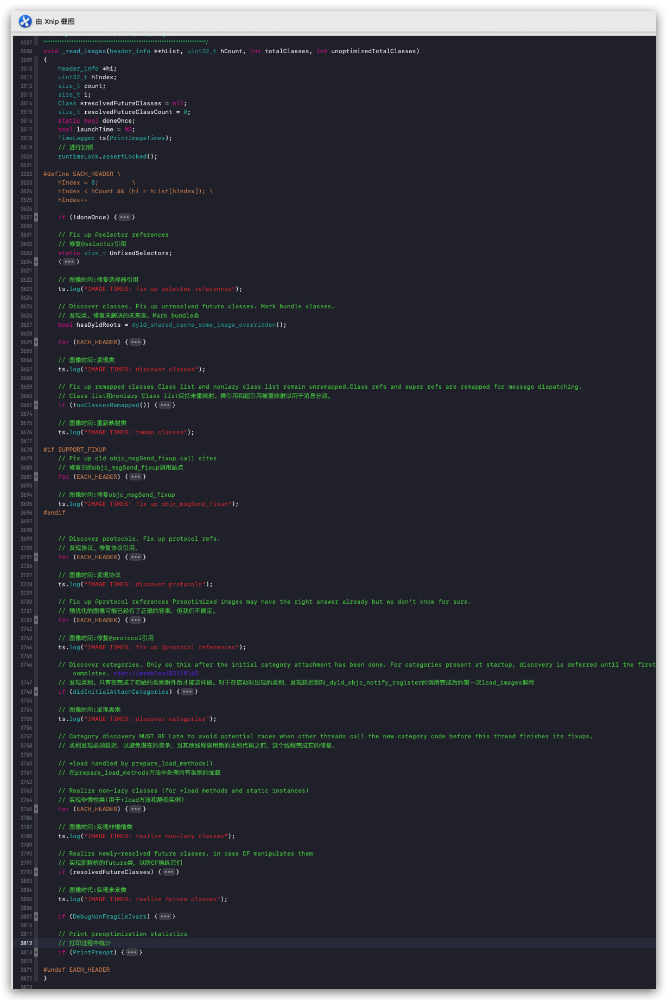

#  OC分类

### 一、分类的作用
>对现有已存在的类添加方法，但是不想在现有类中进行修改，如果团队开发，直接在现有类中进行修改，会导致别人的代码出现bug或者其他意外，所以有了分类。

#### 疑问：

1、分类中能否添加成员变量？

>首先分类中没有isa指针，而且在objc源码中查看分类的结构体时会发现，并没有存储成员变量的列表。所以没有办法给分类添加成员变量

2、分类中能否添加属性？

>分类中可以添加属性，系统会给我们声明setter以及getter方法，但是在setter和getter方法里面并没有进行赋值以及取值操作，所以正常理论上来说是不能添加属性的。但是结合runtime就可以实现给分类添加属性，runtime有两个API可以辅助我们实现```id objc_getAssociatedObject(id object, const void *key)```实现取值，```void objc_setAssociatedObject(id object, const void *key, id value, objc_AssociationPolicy policy)```赋值。如下示例：

 ```
 #import "LGPerson.h"
 NS_ASSUME_NONNULL_BEGIN
 @interface LGPerson (KGPerson)
 @property (nonatomic,copy) NSString *name;
 @end
 NS_ASSUME_NONNULL_END
 ```
 
 ```
#import "LGPerson+KGPerson.h"
#import <objc/runtime.h>
static NSString *nameKey = @"NAME_KEY";
@implementation LGPerson (KGPerson)
- (NSString *)name{
    return objc_getAssociatedObject(self, &nameKey);
}
- (void)setName:(NSString *)name{
    objc_setAssociatedObject(self, &nameKey, name, OBJC_ASSOCIATION_COPY_NONATOMIC);
}
@end
 ```

### 二、分类的结构体
```
struct category_t {
    const char *name;	//分类类名
    classref_t cls;		//具体含义不太清楚
    WrappedPtr<method_list_t, PtrauthStrip> instanceMethods; //对象方法列表
    WrappedPtr<method_list_t, PtrauthStrip> classMethods; //类方法列表
    struct protocol_list_t *protocols; //协议方法列表
    struct property_list_t *instanceProperties; //属性列表
    // Fields below this point are not always present on disk.
    struct property_list_t *_classProperties;

    method_list_t *methodsForMeta(bool isMeta) {
        if (isMeta) return classMethods;
        else return instanceMethods;
    }

    property_list_t *propertiesForMeta(bool isMeta, struct header_info *hi);
    
    protocol_list_t *protocolsForMeta(bool isMeta) {
        if (isMeta) return nullptr;
        else return protocols;
    }
};
```
 从以上分类的结构体可以看出，我们可以在分类中添加对象方法、类方法、协议以及属性，但是需要注意的就是系统只会生成setter和getter方法的声明，需要我们自己去实现setter和getter方法。

 针对属性实现setter方法赋值和getter方法取值，我们考虑有哪些方法处理？如果有怎么实现，方案的缺点？
 
有如下几种方案：

>（1）、声明一个全局的变量。缺点：如果有多个有多个对象，就会共用一个全局变量，其中一个对象修改，所有对象的值都会改变。

>（2）、声明一个全局的字典存储。优点：避免了对象之间赋值相互影响问题。缺点：线程不安全

>（3）、使用runtime的api。优点：避免了对象之间赋值相互影响问题。

#### 疑问：在分类中添加的方法以及属性那些，为什么我们在类对象中可以访问到？我们并没有去创建分类对象，怎么去访问到的？下面带着疑问开始重点Category分类的加载过程探索，

### 三、分类的加载过程

 由于整个合并加载过程由runtime去完成，所以我们从runtime的初始化方法开始进行分析，以下是runtime的初始化方法。
 
```
void _objc_init(void){
    //使用静态变量确保该方法不会被重复执行
    static bool initialized = false;
    if (initialized) return;
    initialized = true;
    
    // fixme defer initialization until an objc-using image is found?
    // 修复延迟初始化直到找到一个使用对象的图像?
    //初始化环境变量
    environ_init();
    //进行线程绑定
    tls_init();
    //调用C++静态构造函数
    static_init();
    //初始化runtime
    runtime_init();
    //初始化libobjc的异常处理系统。
    exception_init();
    //初始化缓存
    cache_t::init();
    _imp_implementationWithBlock_init();
    //注册函数通知(镜像的映射,加载,解除映射),在这里主要看map_images的实现
    	 /* _dyld_objc_notify_register*
    	 * map_images：方法回调的地址作为参数，主要是读取处理给定的镜像文件
    	 * load_images：这个方法就是将经过处理的镜像文件进行加载
    	 * unmap_image：处理未映射的镜像
    	 */
    _dyld_objc_notify_register(&map_images, load_images, unmap_image);
}

```

从初始化方法中我们看到我们需要的Category的加载过程是在```void map_images(unsigned count, const char * const paths[],const struct mach_header * const mhdrs[])```中实现的，所以重点看下这个方法的实现。处理dyld映射到的给定图像

```
void
map_images(unsigned count, const char * const paths[],
           const struct mach_header * const mhdrs[])
{
    //运行时锁定
    mutex_locker_t lock(runtimeLock);
    return map_images_nolock(count, paths, mhdrs);
}
```

然后调用```map_images_nolock```方法，我们继续往下查找。

```
void 
map_images_nolock(unsigned mhCount, const char * const mhPaths[],
                  const struct mach_header * const mhdrs[])
{
    ...
    if (hCount > 0) {
        _read_images(hList, hCount, totalClasses, unoptimizedTotalClasses);
    }
    ...
}
```
在这个方法里面主要做了四件事情：

1、拿到dyld传过来的header，进行封装

2、初始化selector

3、初始化autorelease pool page

4、读取images

经过一系列的处理，最后开始去读取镜像```_read_images```，这个方法内容比较多，先将判断以及循环等条件关系进行折叠，然后我们会发现系统给出了很清晰的注释，按照注释我们逐步去寻找解读我们需要的内容，大概内容如下：

1、在这个方法中第一个条件判断是否是首次加载，在这个判断中主要做了以下几件事情：

>（1）、如果镜像文件中包含swift代码，并且该swift框架早于版本swift3.0，那么禁用isa指针。

>（2）、如果是Mac OS X系统环境，第一：系统版本是在10.11版本以前的旧版本，那么禁用isa指针，但是这块的代码被注释了，具体原因不太清楚，可能是苹果对以前的旧版本进行了某些兼容，或者不在支持以前的旧版本。第二：如果镜像文件中包含```__DATA```和```__objc_rawisa```字段，那么禁用ISA指针

>（3）、主要就是这块，在这里将发现的类添加到类的```gdb_objc_realized_classes``` 表中。

2、修复选择器引用

3、发现类。修复未解决的未来类

4、重新映射类

5、修复旧的objc_msgSend_fixup调用站点

6、发现协议。修复协议引用

7、修复@protocol引用

8、发现类别，在这块代码中有一些注释，如下：

>（1）、只有在完成了初始的类别附件后才能这样做。对于在启动时出现的类别，发现延迟到对_dyld_objc_notify_register的调用完成后的第一次load_images调用

>（2）、类别发现必须延迟，以避免潜在的竞争，当其他线程调用新的类别代码之前，这个线程完成它的修复

>（3）、在```prepare_load_methods ```方法中处理所有类别的加载

9、实现非懒惰类

10、实现未来类

到这里```map_images```对镜像文件的处理意见完成，那么接下来看下，Category内的属性、方法、协议等是怎么添加到类中的，我们跟随系统断点一直跟到```load_images```函数中。

```
void
load_images(const char *path __unused, const struct mach_header *mh)
{
    /*
     * didInitialAttachCategories启动时出现的类别初始附件是否有
     * didCallDyldNotifyRegister对_dyld_objc_notify_register的调用是否已经完成
     */
    if (!didInitialAttachCategories && didCallDyldNotifyRegister) {
        didInitialAttachCategories = true;
        loadAllCategories();
    }

    // Return without taking locks if there are no +load methods here.
    // 如果这里没有+load方法，则不带锁返回。
    if (!hasLoadMethods((const headerType *)mh)) return;

    recursive_mutex_locker_t lock(loadMethodLock);

    // Discover load methods
    // 发现加载方法
    {
        mutex_locker_t lock2(runtimeLock);
        prepare_load_methods((const headerType *)mh);
    }

    // Call +load methods (without runtimeLock - re-entrant)
    // 调用+加载方法(没有runtimlock - re-entrant)
    call_load_methods();
}
```
