# Xcode多环境开发


在平时开发中经常会遇到多个环境下进行开发，比如说：发布到线上的时候用的的是线上环境，然后开发阶段用的的是开发环境，测试环境用的又是一个测试环境，在这种情况下，我们需要来回去修改项目中的接口请求地址、文件上传地址、文件预览地址等，很麻烦，而且如果有一个搞混了，项目很容易出现bug，所以今天探索下，怎么去配置多环境开发。

目前来说探索以下三种：
>1、配置多Target

>2、在```Build Settings```中配置

>3、通过```xcconfig```文件配置（极力推荐）

下面通过详细讲解三种方法的配置方法来分析下优缺点

### 配置多Target

1、创建多Target，选中目标项目，然后选择```TARGETS```，如下图所示：

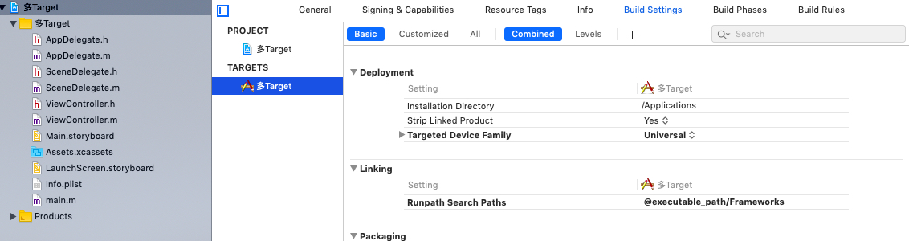

2、选中当前项目的Target后点击复制，然后修改Copy后的Target修改名称以及info.plist，如下图所示：

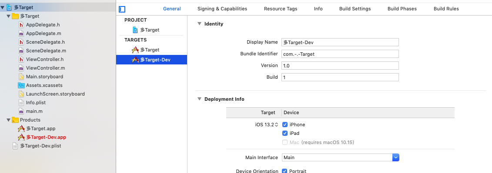

3、然后修改对应Target的```Display Name```以及```Bundle Indentifier```，然后修改对应```Target```下的```Build Settings```中```info.plist```文件路径，如下图所示：

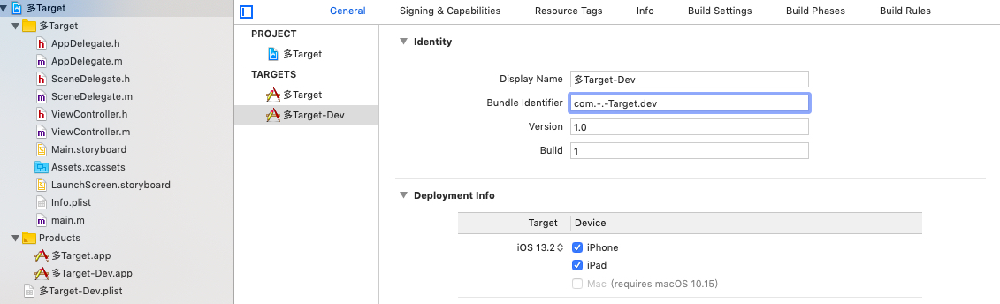
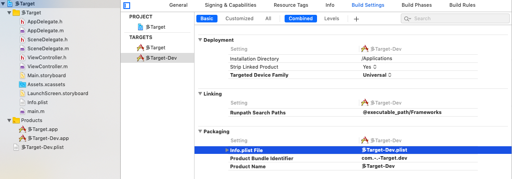

4、然后选择不同的Target运行项目，我们会发现是不同的APP，这种比较适合相同的源码，但是需要定制不同名称和id的APP。

5、如果需要在代码中根据不同的Target进行判断，需要在```Build Settings```中进行设置：

> OC项目：搜索```macors```然后添加自己的预处理指令，如下图：

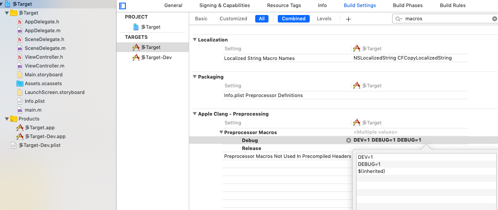

> Swift项目：搜索```swift_flag```然后添加自己的预处理指令，如下图：

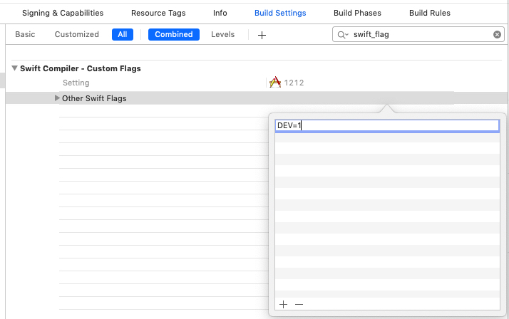

优点：

> 1、可以创建多个Target，单个修改不会影响渠道，可以单独定制APP Icon，名称，id等
>
> 2、可以通过不同的预处理指令，增减不同的代码逻辑

缺点：

> 1、配置比较麻烦，需要修改的地方比较多
>
> 2、配置过程很容易混乱
> 
> 3、多人开发的时候，出现bug的时候增加了排查难度

### 配置```Build Settings```

1、在项目中选择Target，然后选择```Build Settings```，然后点击顶部加号，选择```Add User-Defined Setting```，然后设置自定义的字段名，例如:```BASE_URL```，然后设置不同模式下的值，如下图所示：

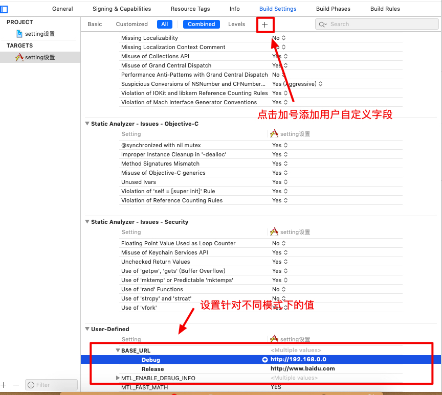

2、选择```info.plist```，添加自定义字段，字段key可以自定义，但是value必须按照如图所示模式，里面的字段必须是在```Build Settings```中添加的用户自定义字段Key，如下图所示：

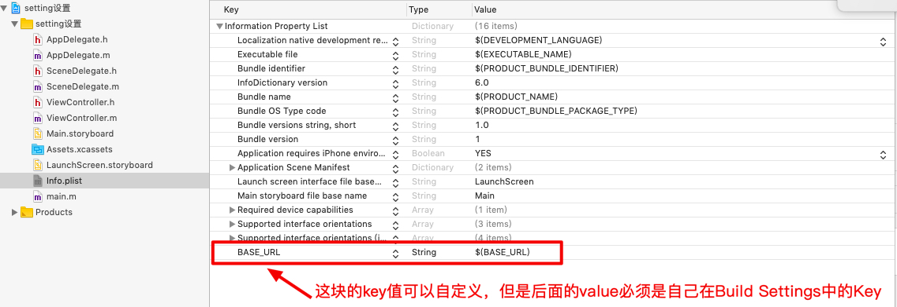

3、然后在代码中使用，在DEBUG模式下，如下图所示：

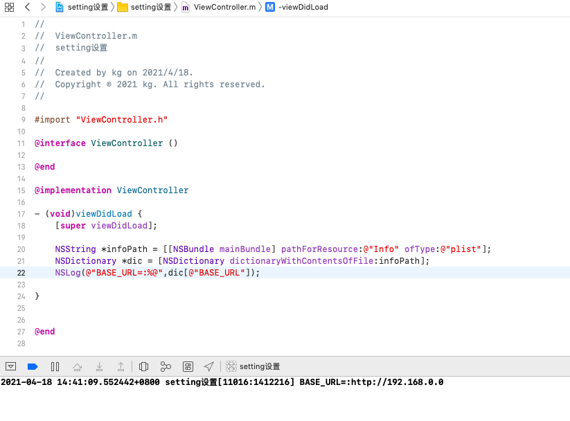

4、系统会根据我们不同的模式会获取我们在不同模式下设置的值，达到不同环境的配置不同域名效果，也可以设置其他值

优点：

> 1、配置相对来说比较少
> 
> 2、能够通过自定义字段来达到不同环境配置不同地址的效果

缺点：

> 1、局限性很大，而且相对多人开发来说可读性比较差

### 配置```xcconfig```文件

说道```xcconfig```文件，我想很多人是即熟悉又陌生，为什么这么说呢？首先我们作为iOS开发，基本上每个人都接触过Cocoapods，Cocoapods管理三方库后，使用的配置文件就是```.xcconfig```文件，所以说相对来说是比较熟悉的，因为都见过，基本每个项目都有，那么陌生是因为虽然很常见，但是没有去了解过用来干啥的，作用是啥，今天就通过配置多环境一起看下

1、首先我们在项目中创建一个```config```文件夹，然后```Commond + N```，在搜索框中输入```Configuration Settings File```一般只要输入```con```就能出现，然后选中文件，点击继续，设置名称，然后点击继续，如下图所示：

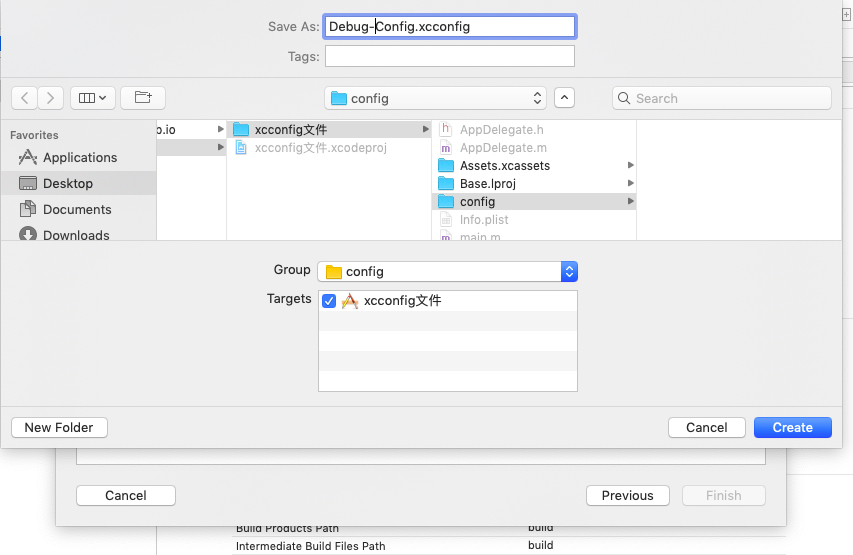

2、然后我们在对应的config文件中进行一些相关的配置，比如说加载一些依赖库，或者多环境下的域名等

> 首先：在```Info.plist```中新增一个自定义字段，如下图所示：

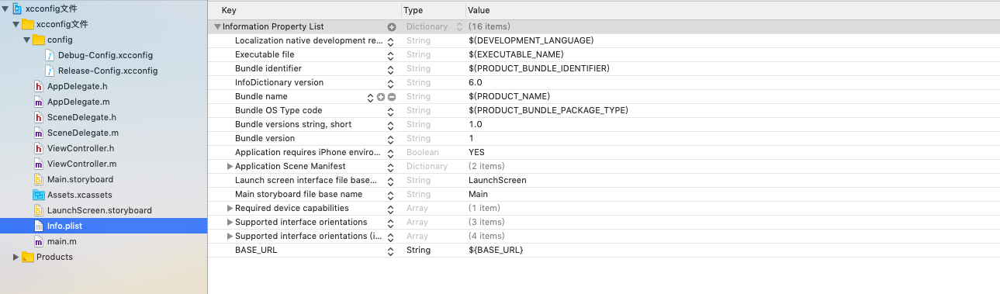

> 其次：在```.xcconfig```文件中进行配置，如下图所示：

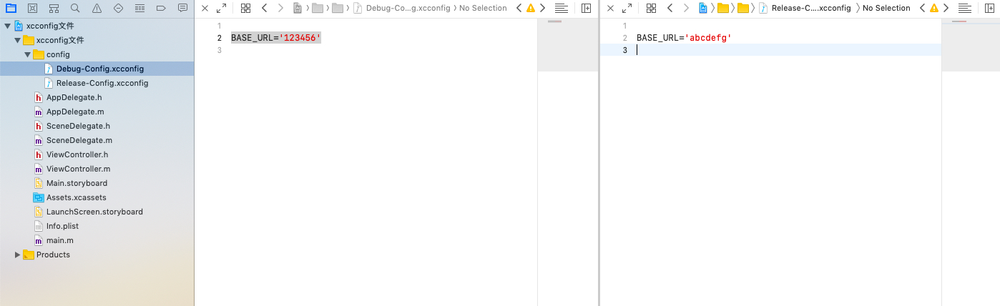

>最后：在代码中使用，如下图所示：

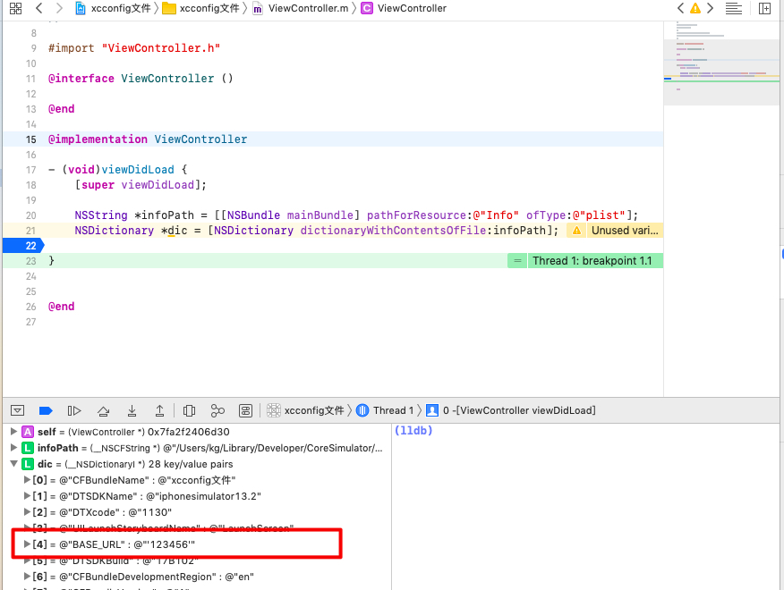

优点：

> 1、可以针对不同的```Scheme```设置相应的环境变量
> 
> 2、可以针对不同的```Scheme```添加我们需要的依赖库等工具
> 
> 3、便于管理和配置

缺点：

> 暂无

以上就是针对多环境开发的配置，个人的一些探索经验以及观点。