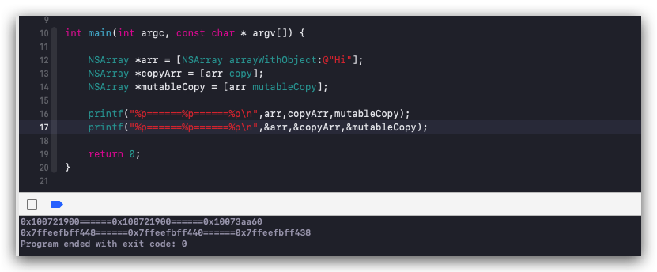
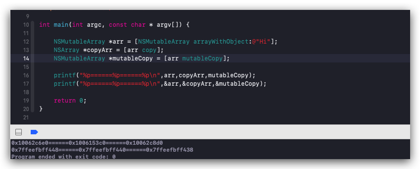
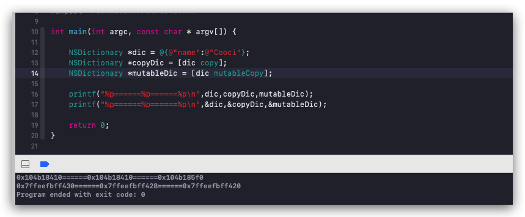
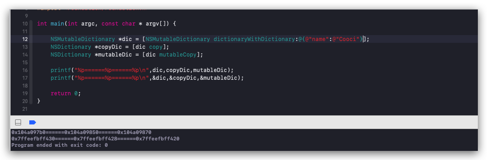
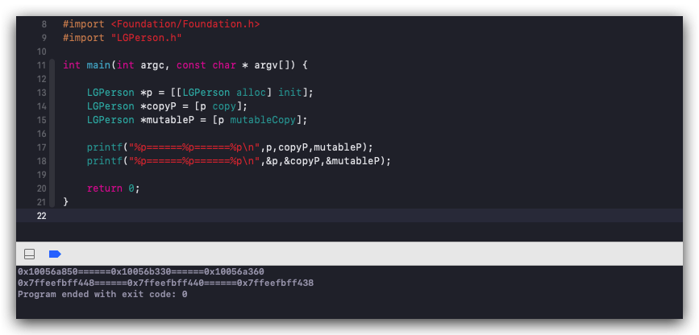

# 深拷贝与浅拷贝

一般开发中经常会遇到数组拷贝或者字典拷贝等，而且很多时候需要对象拷贝，但是从来没有注意过copy与mutableCopy具体对于不同类型的数据拷贝的效果，只知道copy是浅拷贝，mutableCopy是深拷贝，今天一起看下是否是这么回事儿。

### NSArray

NSArray在开发中是无处不在的，所以先看下对它的浅拷贝和盛拷贝效果。



通过以上代码以及打印结果可以看出，```NSArray```通过不同的方式拷贝，最终的得到的结论如下：
> 1、通过```copy```拷贝是浅拷贝，只做了指针拷贝，本身```NSArray```类型的数据在内存中只存在一份，有两个指针指向它
> 2、通过```mutableCopy```拷贝是深拷贝，内存中存在两份```NSArray```类型的数据，各自都有一个指针指向内存中的数据

### NSMutableArray

NSMutableArray在开发中是最常用的，特别是有列表数据的时候，所以看下```NSMutableArray```不同方式的拷贝，效果是怎样的。



通过以上代码以及打印结果可以看出，```NSMutableArray```通过不同方式的拷贝，最终得到如下结论：
> 1、通过```copy```拷贝是深拷贝，但是可变数组经过```copy```拷贝出来后变成了不可变数组，内存中存在两份数据，一份是本身```NSMutableArray```类型的数据，一份是```NSArray```类型的数据
> 2、通过```MutableCopy```拷贝是深拷贝，并且拷贝出来的数据还是```NSMutableArray```类型的数据，在内存中存在两份，各自有一个指针指向

### NSDictionary

```NSDictionary ```字典数据是开发中到处都有的，它的```特色```就是通过```key-value```存取。那么接下来看下```NSDictionary```通过不同的拷贝方式，结果又是如何呢？



通过以上代码以及打印结果可以看出，```NSDictionary ```通过不同的方式拷贝，最终的得到的结论如下：
> 1、通过```copy```拷贝是浅拷贝，只做了指针拷贝，本身```NSDictionary ```类型的数据在内存中只存在一份，有两个指针指向它
> 2、通过```mutableCopy```拷贝是深拷贝，内存中存在两份```NSDictionary ```类型的数据，各自都有一个指针指向内存中的数据

### NSMutableDictionary

```NSMutableDictionary```在开发中是最常用的，特别是有列表数据的时候，所以看下```NSMutableDictionary ```不同方式的拷贝，效果是怎样的。



通过以上代码以及打印结果可以看出，```NSMutableDictionary```通过不同方式的拷贝，最终得到如下结论：
> 1、通过```copy```拷贝是深拷贝，但是可变数组经过```copy```拷贝出来后变成了不可变字典，内存中存在两份数据，一份是本身```NSMutableDictionary```类型的数据，一份是```NSDictionary```类型的数据
> 2、通过```MutableCopy```拷贝是深拷贝，并且拷贝出来的数据还是```NSMutableDictionary```类型的数据，在内存中存在两份，各自有一个指针指向

### LGPerson

```LGPerson```在开发中也有需要对象实现拷贝操作，但是我们是需要深拷贝还是浅拷贝呢？这个问题先留着，先看下效果：



此处需要注意，如果我们需要对象具有拷贝功能，那么必须实现```NSCopying```或```NSMutableCopy```协议，这两个协议都是只有一个方法需要实现：```- (nonnull id)copyWithZone:(nullable NSZone *)zone```以及```- (nonnull id)mutableCopyWithZone:(nullable NSZone *)zone```。接下来看下具体实现：

```
@implementation LGPerson

- (nonnull id)copyWithZone:(nullable NSZone *)zone {
    LGPerson *p = [[[self class] allocWithZone:zone] init];
    return p;
}

- (nonnull id)mutableCopyWithZone:(nullable NSZone *)zone {
    LGPerson *p = [[LGPerson alloc] init];
    return p;
}

@end
```

此处没有写属性，但是无论有没有属性，对于对象来说都是深拷贝。我们可以通过上面打印得到验证。

### 总结

通过以上几个验证，我们可以得到以下几个结论：
> 1、对于系统的非容器类对象，如：NSString，如果是不可变对象，对对象进行拷贝操作，```copy```就是浅拷贝，```mutableCopy```就是深拷贝。
> 2、对于系统的非容器类对象，如果是可变对象，如：NSMutableNSString，对对象进行拷贝操作，```copy```就是深拷贝，但是拷贝出来的对象是个不可变的，```mutableCopy```就是深拷贝，类型也是也可变类型。
> 3、对于系统的容器类对象，如果是不可变对象，如：NSArray，对对象进行拷贝操作，```copy```就是浅拷贝，```mutableCopy```就是深拷贝。
> 4、对于系统的容器类对象，如果是可变对象，如：NSMutableArray，对对象进行拷贝操作，```copy```就是深拷贝，但是拷贝出来的对象是个不可变的，```mutableCopy```就是深拷贝，类型也是也可变类型。
> 5、对于用户自定义对象，无论是```copy```还是```mutableCopy```都是深拷贝
