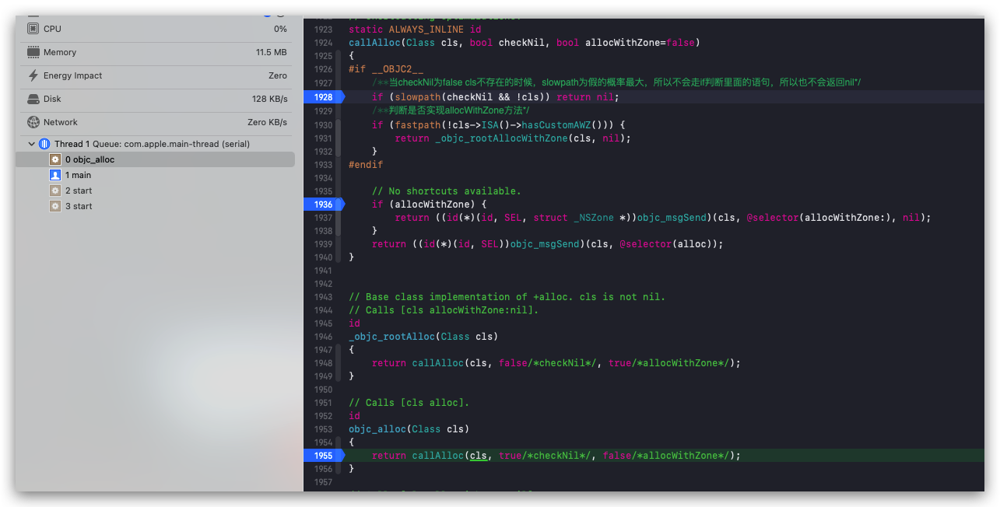
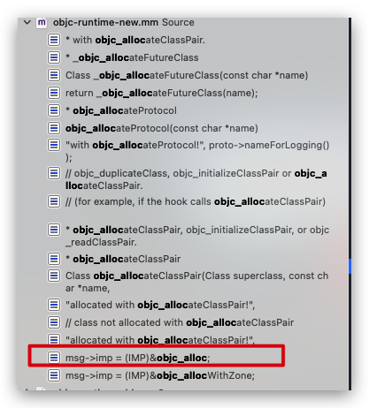
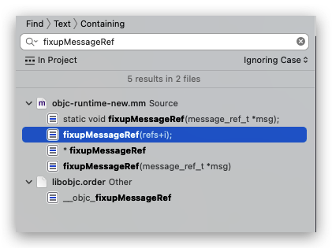
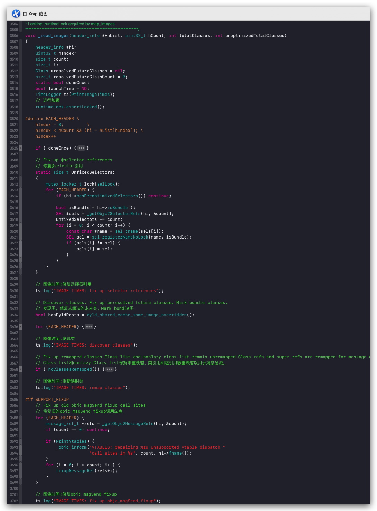
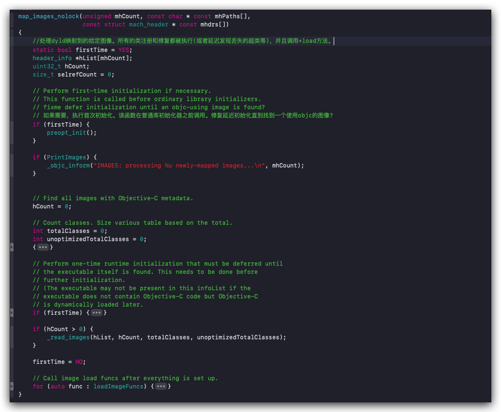
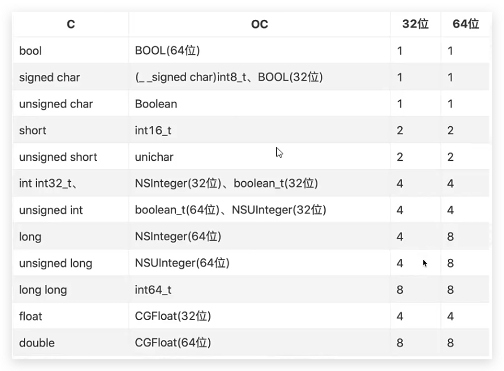

# 结构体内存对齐

### alloc方法调用前做了什么
开篇前先看看alloc方法调用前系统做了什么，解决上篇文章遗留的一个点，为什么源码流程和程序运行流程不一致的问题。
上篇文章介绍了从调用alloc开始到对象开辟出内存的一系列流程，打开是这样的```[LGPerson alloc]->_objc_rootAlloc->callAlloc```应该是这样走才对，系统本身代码流程也是这么走的，但是当我们用断点调试查看的堆栈信息的时候，系统不是这么执行的，如下图：

当走断点查看的时候，代码是先跑的```objc_alloc```，但是看了好几遍，系统确实没有调用这个函数，那么是怎么执行到这里的呢？我们是不是可以猜测，系统在某个地方手动修改```alloc```方法的调用了呢？既然先走的```objc_alloc```那么我们是否可以先看下，在哪里调用的这个函数呢？带着疑问，在```objc```源码中全局搜索```objc_alloc```，我们可以看到调用```objc_alloc```函数的地方只有一个，如下图：

既然只有一个地方调用了，那么问题估计就是在这块，带着好奇心，点击打开源码，如下所示：

```
static void 
fixupMessageRef(message_ref_t *msg)
{    
    msg->sel = sel_registerName((const char *)msg->sel);

    if (msg->imp == &objc_msgSend_fixup) { 
        if (msg->sel == @selector(alloc)) {
            msg->imp = (IMP)&objc_alloc;
        } else if (msg->sel == @selector(allocWithZone:)) {
            msg->imp = (IMP)&objc_allocWithZone;
        } else if (msg->sel == @selector(retain)) {
            msg->imp = (IMP)&objc_retain;
        } else if (msg->sel == @selector(release)) {
            msg->imp = (IMP)&objc_release;
        } else if (msg->sel == @selector(autorelease)) {
            msg->imp = (IMP)&objc_autorelease;
        } else {
            msg->imp = &objc_msgSend_fixedup;
        }
    } 
    else if (msg->imp == &objc_msgSendSuper2_fixup) { 
        msg->imp = &objc_msgSendSuper2_fixedup;
    } 
    else if (msg->imp == &objc_msgSend_stret_fixup) { 
        msg->imp = &objc_msgSend_stret_fixedup;
    } 
    else if (msg->imp == &objc_msgSendSuper2_stret_fixup) { 
        msg->imp = &objc_msgSendSuper2_stret_fixedup;
    } 
#if defined(__i386__)  ||  defined(__x86_64__)
    else if (msg->imp == &objc_msgSend_fpret_fixup) { 
        msg->imp = &objc_msgSend_fpret_fixedup;
    } 
#endif
#if defined(__x86_64__)
    else if (msg->imp == &objc_msgSend_fp2ret_fixup) { 
        msg->imp = &objc_msgSend_fp2ret_fixedup;
    } 
#endif
}
```
果然是系统进行了处理，如果```SEL```是```@selector(alloc)```那么将对象```IMP```修改为```(IMP)&objc_alloc```，罪魁祸首找到了，那么像我这种好奇心满满的人，只会满足于此吗？当然不会，找到在哪修改的，并没有解决问题，这块有个```&objc_msgSend_fixup```判断，如果对象的```imp```等于它进入```imp```修改，那么这个```objc_msgSend_fixup```是啥呢？点击跳转可以看到```OBJC_EXTERN void objc_msgSend_fixup(void);```这个函数只是个声明，而且返回值为空，那么这个判断就好理解了，判断对象的```sel```是否存在，因为是对一个不存在的值取地址了，所以第一次进入会走```if```判断里面，修改对象```imp```为```(IMP)&objc_alloc```。那么什么时候调用的这个```static void fixupMessageRef(message_ref_t *msg);```函数呢？在```objc```源码中进行全局搜索，发现调用这个函数的地方只有一个，如下图：


然后我们点击进入查看源码，发现调用函数的是在```extern void _read_images(header_info **hList, uint32_t hCount, int totalClasses, int unoptimizedTotalClass);```这个函数中，代码有点多，我重点是去看```fixupMessageRef```这个函数实现的地方，然后丢弃一些其他属性的操作，代码大概如下：



从源码中可以看出，系统先修复了```@selector```引用，然后再修复旧的```objc_msgSend_fixup```调用站点，然后继续查找什么时候调用的```_read_images ```函数，全局搜索，找到两处，先看下```map_images_nolock```这个函数的实现，源码如下：



这个函数是用来处理dyld映射到的给定图像。所有的类注册和修复都被执行(或者延迟发现丢失的超类等)，并且调用+load方法。简单理解就是读取所有的类并调用+load方法。然后继续查找调用这个函数的地方，我们全局搜索可以找到```map_images```函数中调用了，然后这个函数先开始进行加锁保护，然后直接调用```map_images_nolock```函数，继续查看我们发现```_dyld_objc_notify_register(&map_images, load_images, unmap_image);```在这里调用了```map_images```函数，然后这个调用```_dyld_objc_notify_register(&map_images, load_images, unmap_image);```这个函数的地方就是```_objc_init```那么问题就清晰了，这个函数就是加载我们程序加载的入口了。最终我们找到了整个```alloc```函数被修改前的一系列流程了，也弄清了什么时候系统对对象调用```alloc```方法进行修复了。

### 结构体内存对齐

嘿嘿，盗了个图，先上图（来自于[大神Cooci](https://juejin.cn/user/3650034335487975)）:



首先为什么要探索结构体内存对齐呢？因为看```objc```源码会发现万物皆对象的基础是个结构体，当我们创建对象的时候，不需要去注意属性的先后顺序，因为系统会自动帮我们处理，但是当我们创建结构体的时候就需要我们去分析了，以为系统不会自动给我们优化，先来看下下面两个结构体：

```
struct LGStruct1 {
    double a;
    char b;
    int c;
    short d;
}struct1;

struct LGStruct2 {
    double a;
    int b;
    char c;
    short d;
}struct2;
```
首先我们声明以上两个结构体，两个结构体拥有的数据类型是一摸摸一样样的，然后先看下以下代码：

```
printf("%lu=========%lu\n",sizeof(struct1),sizeof(struct2));
```
按照我们正常情况来说，```double```占用8字节，```char```占用一个字节，```int```占用4个字节，```short```占用2个字节。总共下来15个字节，然后经过字节对齐运算后，应该计算出来的结构体占用的空间大小为16字节，然后内存对齐按照16字节对齐，所以还是16，系统应该输出16才对，但是当我们运行程序的时候发现，并不是，以下是输出结果:

```
24=========16
```
那么就有问题了，为什么相同的数据类型，里面属性个数也是一样的，但是占用的空间大小不一样呢？这就是今天的重点，结构体内存对齐原则，它遵守以下规则：
> 1、数据成员对齐规则：结构体或者联合体的数据成员，第一个数据成员放在offset为0的地方，以后每个数据成员存储的起始位置要从该成员大小或者成员的子成员大小（只要该成员有子成员，比如数组，结构体等）的整数倍开始（比如int为4字节，则要从4的整数倍地址开始存储）。通俗来讲就是除了第一个位置，后面的每个成员存放的位置起始位置都要存放的那个成员（如果有子成员那就是子成员）的整数倍位置。
> 
> 2、结构体作为成员：如果一个结构体里面有某些结构体成员，则结构体成员要从其内部最大元素大小的整数倍地址开始存储。
> 
> 3、收尾工作：结构体的总大小，也就是sizeof的结果，必须是其内部最大成员的整数倍，不足的要补齐。

接下来看下下面的结构体：

```
struct LGStruct3 {
    double a;
    int b;
    char c;
    short d;
    int e;
    struct LGStruct1 str;
}struct3;
```
这时候当我们输出打印```sizeof(struct3)```的时候，结果是```48```，那么这个48是怎么来的呢？按照以上的原则，我们去计算，如下：
```
a存储位置为[0~7]，大小为8字节
b存储位置为[8~11]，大小为4字节
c存储位置为[12]，大小为1字节
d存储位置为[14~15]，大小为2字节
e存储位置为[16~19]，大小为4字节
str存储位置为[24~47]，大小为24字节，这个是上面输出已知的。
```
按照上面的计算```struct3```的sizeof应该是48，但是还有一个计算规则，那就是总体大小必须是最大成员的整数倍，这个结构体中最大成员是```double```类型的成员其大小为8字节，所以需要补齐，最后得到48。然后我们继续看下面结构体：

```
struct LGStruct4 {
    double a;
    int b;
    char c;
    short d;
    int e;
    struct LGStruct2 str;
}struct4;
```
这时候当我们输出打印```sizeof(struct4)```的时候，结果是```40```，那么这个40是怎么来的呢？按照以上的原则，我们再次去计算，如下：
```
a存储位置为[0~7]，大小为8字节
b存储位置为[8~11]，大小为4字节
c存储位置为[12]，大小为1字节
d存储位置为[14~15]，大小为2字节
e存储位置为[16~19]，大小为4字节
str存储位置为[24~39]，大小为16字节，这个是上面输出已知的。
```
按照上面的计算```struct4```的sizeof应该是40，但是还有一个计算规则，那就是总体大小必须是最大成员的整数倍，这个结构体中最大成员是```double```类型的成员其大小为8字节，所以需要补齐，最后得到40。

### calloc内存开辟

上篇文章我们我们看```alloc```流程的时候，有以下一段代码：

```
id obj;
    if (zone) {
        obj = (id)malloc_zone_calloc((malloc_zone_t *)zone, 1, size);
    } else {
        // 申请内存空间
        obj = (id)calloc(1, size);
    }
```
对象内存空间开辟，当我们想要去看的时候，```calloc```函数看不到实现，只能看见申明，那么就要停在这里吗？好奇心如此重的我，怎么能放弃呢，当我们点击```calloc```函数的时候，进入了系统的```include/malloc```文件夹中，那么是否苹果也有开源这块的代码呢？怀着好奇心，去[opensource](https://opensource.apple.com/release/macos-113.html)搜搜看，果然找到了```libmalloc-317.100.9```，苹果还是比较开源的，所以赶紧下载下来看看，下载下来后，会会报错的，运行不起来，但是[Cooci大神](https://github.com/LGCooci/objc4_debug)完成了。直接下载下来用就OK了，然后我们也是下载下来，打开后里面已经创建好```Target```了，所以只需要运行调式就可以了。

在```main```函数中编写一段代码，调试```calloc```函数。代码如下:

```
#import <Foundation/Foundation.h>
#import <malloc/malloc.h>

int main(int argc, const char * argv[]) {
    @autoreleasepool {
		// 堆 对象的内存 16字节对齐
		// 成员变量 8字节对齐 结构内部
		// 对象 对象 16字节
		
		// 野指针 内存访问
		void *p = calloc(1, 40);
		NSLog(@"%lu",malloc_size(p));
        NSLog(@"Hello, World!");
    }
    return 0;
}
```
然后我们点击进入```calloc```函数实现中，我们发现直接返回了另外一个函数```_malloc_zone_calloc```，那么再进入```_malloc_zone_calloc```函数中，然后进入函数```_malloc_zone_calloc ```中，我们主要看返回值，然后根据返回值确定函数中的重点代码，因为返回了一个```ptr```，所以直接定位到1560行，但是又是一个```calloc```函数，我们又看不到具体实现，但是我们可以看到在这里进行了赋值，我们直接打印```zone->calloc```控制台输出了```default_zone_calloc```函数，那么直接全局搜索这个函数，然后找到这个函数的实现，发现里面又是调用```calloc```函数，我们再次打印```zone->calloc```，控制台输出```nano_calloc```，然后继续寻找函数实现，代码如下：

```
static void *
nano_calloc(nanozone_t *nanozone, size_t num_items, size_t size)
{
	size_t total_bytes;

	if (calloc_get_size(num_items, size, 0, &total_bytes)) {
		return NULL;
	}

	if (total_bytes <= NANO_MAX_SIZE) {
		void *p = _nano_malloc_check_clear(nanozone, total_bytes, 1);
		if (p) {
			return p;
		} else {
			/* FALLTHROUGH to helper zone */
		}
	}
	malloc_zone_t *zone = (malloc_zone_t *)(nanozone->helper_zone);
	return zone->calloc(zone, 1, total_bytes);
}
```
在这个函数中我们能够看到一个关键字段```total_bytes```，这个就是获取calloc()的分配大小。然后又调用了```_nano_malloc_check_clear```函数，函数实现中判断```ptr```是否存在，第一次进入肯定是不存在的，所以直接看```else```分支，发现调用了```segregated_next_block```函数，然后进入这个函数的实现中，发现是一个```while```循环，代码如下：

```
static MALLOC_INLINE void *
segregated_next_block(nanozone_t *nanozone, nano_meta_admin_t pMeta, size_t slot_bytes, unsigned int mag_index)
{
	while (1) {
		uintptr_t theLimit = pMeta->slot_limit_addr; // 现在捕获限制slot_bump_addr的插槽限制
		uintptr_t b = OSAtomicAdd64Barrier(slot_bytes, (volatile int64_t *)&(pMeta->slot_bump_addr));
		b -= slot_bytes; // 原子操作返回addr的*next*空闲块。减去这个值得到addr。

		if (b < theLimit) {   // 我们是否在目前的插槽分配范围内?
			return (void *)b; // 是的，所以这个线程增加的slot_bump_addr很好
		} else {
			if (pMeta->slot_exhausted) { // 用尽了这个时段所有的空间?
				pMeta->slot_bump_addr = theLimit;
				return 0;				 // 直接返回0，结束
			} else {
				// 一个线程将增长堆，其他线程将看到它增长和重试分配
				_malloc_lock_lock(&nanozone->band_resupply_lock[mag_index]);
				// 重新检查状态，我们已经锁上了
				if (pMeta->slot_exhausted) {
					_malloc_lock_unlock(&nanozone->band_resupply_lock[mag_index]);
					return 0; // Toast
				} else if (b < pMeta->slot_limit_addr) {
					_malloc_lock_unlock(&nanozone->band_resupply_lock[mag_index]);
					continue; // ... 该插槽是由第一个接受者(不是我们)成功增长的。现在再试一次
				} else if (segregated_band_grow(nanozone, pMeta, slot_bytes, mag_index)) {
					_malloc_lock_unlock(&nanozone->band_resupply_lock[mag_index]);
					continue; // ... 槽已经被我们成功的种植了。现在再试一次。
				} else {
					pMeta->slot_exhausted = TRUE;
					pMeta->slot_bump_addr = theLimit;
					_malloc_lock_unlock(&nanozone->band_resupply_lock[mag_index]);
					return 0;
				}
			}
		}
	}
}
```
整个流程大概意思就是不断循环查找能够容纳需要的大小的空间，如果找到直接返回空间地址，如果找不到返回0。到这里差不多calloc开辟内存空间的流程也就结束了。

### 结论

从前面的举例我们不难明白，在开发中，如何去优化体积，怎么减少内存空间的浪费，如何设计结构体，合理利用内存空间，一般设计结构体的时候，我们可以自己通过简单的运算对比，将成员按照占用字节的大小，从大到小的顺序去排序构建结构体，减少开辟非必要的内存。